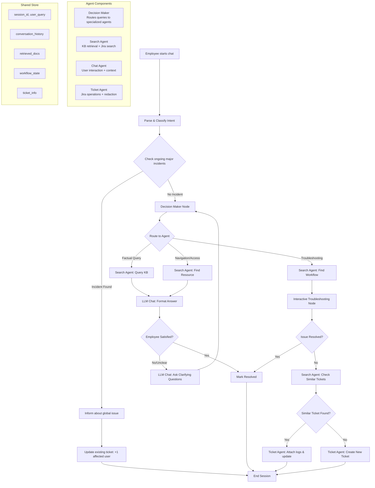

# Design Doc: IT Support Chatbot

## 1. Requirements

### Problem Statement

IT support teams face repetitive inquiries about common issues (password resets, VPN setup, printer troubleshooting) that consume significant time. Employees often struggle to find relevant documentation or articulate their problems effectively, leading to unnecessary ticket creation and delayed resolution.

### Solution

An **Agentic IT Support Chatbot** that:

- Answers factual IT questions using a local knowledge base
- Guides employees through interactive troubleshooting workflows
- Searches for existing tickets related to ongoing major incidents
- Creates well-formatted Jira tickets with logs and redacted sensitive information
- Maintains conversation context across multi-turn interactions
- Operates with privacy-first principles (local embeddings, no sensitive data to external APIs)

### User Stories

1. **Quick Answer**: "As an employee, I want to quickly get answers to common IT questions without creating a ticket."

   - Example: "What is our VPN connection procedure?"
   - Expected: Bot retrieves relevant documentation and provides step-by-step instructions.

2. **Interactive Troubleshooting**: "As an employee with a printer issue, I want guided troubleshooting steps."

   - Example: "My printer won't print."
   - Expected: Bot asks diagnostic questions, provides solutions, tracks progress.

3. **Major Incident Detection**: "As an employee, I want to know if my issue is part of a widespread problem."

   - Example: "I can't access SharePoint."
   - Expected: Bot checks for similar active tickets and informs about known outages.

4. **Ticket Creation**: "As an employee with an unresolved issue, I want the bot to create a properly formatted ticket."

   - Example: After failed troubleshooting, bot offers to create ticket with collected context.

5. **Privacy Protection**: "As an IT admin, I want sensitive information redacted from logs and tickets."
   - Expected: Bot automatically redacts passwords, API keys, personal data before logging.

### Success Criteria

- **Deflection Rate**: 40%+ of queries resolved without ticket creation
- **Response Time**: < 3 seconds for factual queries, < 10 seconds for RAG retrieval
- **User Satisfaction**: 80%+ positive feedback on bot interactions
- **Privacy Compliance**: Zero sensitive data leaks to external LLM APIs

---

## 2. Flow Design

### Applicable Design Patterns

1. **Agent Pattern**: The main orchestrator uses agentic decision-making to route between different specialized sub-agents (Search Agent, Chat Agent, Ticket Agent).

2. **RAG Pattern**:

   - **Offline**: Ingest IT documentation → Chunk → Embed (local model) → Store in ChromaDB
   - **Online**: User query → Embed → Retrieve top-k documents → Generate answer

3. **Workflow Pattern**: Interactive troubleshooting follows a sequential workflow with user feedback loops.

4. **Map-Reduce Pattern**: Ticket search across multiple systems (Jira, internal DB) can be parallelized and aggregated.

### Flow High-Level Design

The system orchestrates multiple specialized agents coordinated by a central Decision Maker:



### Detailed Node Flow

#### Main Flow Nodes:

1. **IntentClassificationNode**

   - Classifies query intent: factual / troubleshooting / navigation
   - Detects greetings, farewells, satisfaction signals

2. **CheckMajorIncidentNode**

   - Searches Jira for active high-priority tickets
   - Checks if employee's issue matches known outages

3. **DecisionMakerNode** (Agent)

   - Context: user_query, intent, conversation_history, retrieved_docs
   - Actions: `search_kb`, `troubleshoot`, `search_tickets`, `create_ticket`, `answer`, `clarify`
   - Returns action name to route flow

4. **SearchKnowledgeBaseNode**

   - Embeds user query locally
   - Retrieves top-k relevant documents from ChromaDB
   - Stores results in shared store

5. **GenerateAnswerNode**

   - Formats answer using LLM (Groq API)
   - Uses retrieved docs as context
   - Ensures no sensitive data in prompt

6. **InteractiveTroubleshootingNode** (Batch + Async)

   - Guides user through step-by-step workflow
   - Waits for user feedback after each step
   - Tracks progress in conversation memory

7. **SearchJiraTicketsNode**

   - Queries Jira API for similar open tickets
   - Compares query embedding to ticket embeddings

8. **CreateTicketNode**

   - Collects context from conversation
   - Redacts sensitive information
   - Creates Jira ticket with proper formatting

9. **UpdateTicketNode**
   - Attaches logs and additional context
   - Redacts sensitive data
   - Links related tickets

#### Sub-Flows:

**Offline Indexing Flow** (runs periodically or on-demand):

```
LoadDocuments → ChunkDocuments → EmbedChunks → StoreInChromaDB
```

**Interactive Troubleshooting Sub-Flow**:

```
LoadWorkflow → PresentStep → WaitUserFeedback → EvaluateProgress → (loop or exit)
```

---

## 3. Utility Functions

### Required Utilities

1. **Call LLM** (`utils/call_llm_groq.py`)

   - **Input**: `prompt: str`
   - **Output**: `response: str`
   - **Necessity**: Used by most nodes for LLM-based tasks (answer generation, decision making)
   - **Current Implementation**: Uses Groq API with llama-3.3-70b-versatile model
   - **Environment Variables**: `GROQ_API_KEY`, `GROQ_MODEL`

2. **Get Embedding** (`utils/embedding_local.py`)

   - **Input**: `text: str`
   - **Output**: `vector: List[float]` (384-dim for all-MiniLM-L6-v2)
   - **Necessity**: Used for query embedding and document indexing
   - **Current Implementation**: Uses sentence-transformers with model caching
   - **Environment Variables**: `EMBED_MODEL`, `EMBEDDING_DEVICE`, `EMBEDDING_NORMALIZE`

3. **Intent Classifier** (`utils/intent_classifier.py`)

   - **Input**: `query: str`
   - **Output**: `{"intent": str, "confidence": float, "scores": dict}`
   - **Necessity**: Routes queries to appropriate agents
   - **Current Implementation**: Rule-based classification for factual/troubleshooting/navigation

4. **Conversation Memory** (`utils/conversation_memory.py`)
   - **Input**: `session_id: str`, operations (add_message, get_history, set_workflow_state)
   - **Output**: Session data, conversation history, workflow state
   - **Necessity**: Maintains context across multi-turn conversations
   - **Current Implementation**: In-memory session store with workflow tracking

### Additional Utilities Needed

5. **ChromaDB Client** (`utils/chromadb_client.py`) ⚠️ **TO BE IMPLEMENTED**

   - **Input**: Various (query_vector, document_chunks, metadata)
   - **Output**: Search results, insertion confirmations
   - **Necessity**: Interface for vector database operations
   - **Functions**:
     - `initialize_client() -> ChromaClient`
     - `create_collection(name: str) -> Collection`
     - `insert_documents(collection, chunks: List[str], embeddings: List[List[float]], metadata: List[dict])`
     - `query_collection(collection, query_embedding: List[float], top_k: int) -> List[dict]`
   - **Environment Variables**: `CHROMADB_HOST`, `CHROMADB_PORT`, `CHROMADB_COLLECTION`

6. **Document Chunker** (`utils/chunker.py`) ⚠️ **TO BE IMPLEMENTED**

   - **Input**: `text: str, chunk_size: int, overlap: int`
   - **Output**: `List[str]` (text chunks)
   - **Necessity**: Breaks large documents into embeddable chunks
   - **Strategy**: Recursive character splitting with overlap
   - **Environment Variables**: `INGESTION_CHUNK_SIZE`, `INGESTION_CHUNK_OVERLAP`

7. **Jira Client** (`utils/jira_client.py`) ⚠️ **TO BE IMPLEMENTED**

   - **Input**: Various (query parameters, ticket data)
   - **Output**: Ticket objects, search results
   - **Necessity**: Interfaces with Jira for ticket operations
   - **Functions**:
     - `search_tickets(jql: str) -> List[dict]`
     - `create_ticket(project: str, summary: str, description: str, **kwargs) -> dict`
     - `update_ticket(ticket_id: str, fields: dict) -> dict`
     - `add_comment(ticket_id: str, comment: str)`
   - **Environment Variables**: `JIRA_URL`, `JIRA_USER`, `JIRA_API_TOKEN`, `JIRA_PROJECT`

8. **Redactor** (`utils/redactor.py`) ⚠️ **TO BE IMPLEMENTED**

   - **Input**: `text: str, patterns: List[str]`
   - **Output**: `redacted_text: str`
   - **Necessity**: Removes sensitive information before logging/ticketing
   - **Patterns**: Passwords, API keys, email addresses, IP addresses, personal names
   - **Implementation**: Regex-based pattern matching with configurable rules

9. **Document Loader** (`utils/document_loader.py`) ⚠️ **TO BE IMPLEMENTED**
   - **Input**: `source_dir: str, file_types: List[str]`
   - **Output**: `List[dict]` with `{"path": str, "content": str, "metadata": dict}`
   - **Necessity**: Loads IT documentation from various formats
   - **Supported Formats**: .txt, .md, .pdf, .docx
   - **Environment Variables**: `INGESTION_SOURCE_DIR`

---

## 4. Data Design

### Shared Store Schema

The shared store uses an in-memory dictionary structure for real-time operations, with ChromaDB for persistent knowledge storage.

```python
shared = {
    # Session Context
    "session_id": "uuid-string",
    "user_id": "employee-email-or-id",
    "timestamp": "2025-10-06T10:30:00Z",

    # Current Query
    "user_query": "My VPN keeps disconnecting",
    "intent": {
        "intent": "troubleshooting",
        "confidence": 0.85,
        "scores": {"factual": 0.1, "troubleshooting": 0.85, "navigation": 0.05}
    },
    "keywords": ["vpn", "disconnect", "connection"],

    # Conversation State
    "conversation_history": [
        {"role": "user", "content": "...", "timestamp": "..."},
        {"role": "assistant", "content": "...", "timestamp": "..."}
    ],
    "turn_count": 3,

    # RAG Results
    "query_embedding": [0.123, 0.456, ...],  # 384-dim vector
    "retrieved_docs": [
        {
            "id": "doc-123",
            "content": "VPN troubleshooting steps...",
            "metadata": {
                "source": "vpn_guide.md",
                "category": "networking",
                "last_updated": "2025-09-15"
            },
            "score": 0.92
        },
        # ... top_k results
    ],
    "rag_context": "Compiled text from retrieved_docs for LLM prompt",

    # Decision Making
    "decision": {
        "action": "troubleshoot",  # search_kb | troubleshoot | search_tickets | create_ticket | answer | clarify
        "reasoning": "User reported technical issue requiring step-by-step guidance",
        "confidence": 0.88
    },

    # Workflow State (for interactive troubleshooting)
    "workflow_state": {
        "workflow_id": "vpn_troubleshooting",
        "issue": "VPN disconnection",
        "all_steps": [
            {"step": 1, "action": "Check internet connection", "status": "completed"},
            {"step": 2, "action": "Restart VPN client", "status": "in_progress"},
            {"step": 3, "action": "Check firewall settings", "status": "pending"}
        ],
        "current_step_index": 1,
        "completed_steps": [0],
        "status": "in_progress"  # in_progress | resolved | escalated
    },

    # Ticket Management
    "major_incident": {
        "found": True,
        "ticket_id": "ITSUP-1234",
        "summary": "SharePoint service outage",
        "affected_count": 47
    },
    "similar_tickets": [
        {
            "ticket_id": "ITSUP-5678",
            "summary": "VPN connection drops",
            "status": "In Progress",
            "similarity_score": 0.89
        }
    ],
    "ticket_created": {
        "ticket_id": "ITSUP-9999",
        "summary": "VPN keeps disconnecting",
        "description": "...",
        "logs_attached": True
    },

    # Final Response
    "response": {
        "text": "I've created ticket ITSUP-9999 for you...",
        "action_taken": "ticket_created",
        "requires_followup": False
    }
}
```

### ChromaDB Schema

**Collection Name**: `it_support_docs` (from env: `CHROMADB_COLLECTION`)

**Document Structure**:

```python
{
    "id": "doc-hash-chunk-index",  # Unique identifier
    "embedding": [0.123, 0.456, ...],  # 384-dim vector
    "document": "Text content of the chunk",  # The actual text
    "metadata": {
        "source_file": "vpn_setup_guide.md",
        "category": "networking",  # networking | hardware | software | access | security
        "doc_type": "guide",  # guide | faq | troubleshooting | policy
        "last_updated": "2025-09-15",
        "chunk_index": 0,
        "total_chunks": 5,
        "tags": ["vpn", "remote-access", "security"]
    }
}
```

### Conversation Memory Schema

Managed by `ConversationMemory` class in `utils/conversation_memory.py`:

```python
session_data = {
    "session_id": "uuid",
    "created_at": "ISO timestamp",
    "last_activity": "ISO timestamp",
    "conversation_history": [
        {"role": "user", "content": "...", "timestamp": "..."},
        {"role": "assistant", "content": "...", "timestamp": "..."}
    ],
    "workflow_state": {
        # Same structure as workflow_state in shared store
    }
}
```

---

## 5. Node Design

### Shared Store Access Patterns

All nodes follow the pattern: **Read in `prep()` → Process in `exec()` → Write in `post()`**

### Node Specifications

---

#### 1. IntentClassificationNode

- **Type**: Regular Node
- **Purpose**: Classify user query intent for routing decisions
- **Steps**:
  - **prep**: Read `shared["user_query"]`
  - **exec**: Call `classify_intent(query)` utility, returns intent dict
  - **post**: Write `shared["intent"]`, return `"default"`

---

#### 2. CheckMajorIncidentNode

- **Type**: Regular Node
- **Purpose**: Check if query matches ongoing major incidents
- **Steps**:
  - **prep**: Read `shared["user_query"]`, `shared["keywords"]`
  - **exec**:
    - Query Jira for high-priority open tickets
    - Compare query similarity to incident descriptions
    - Return incident info or None
  - **post**: Write `shared["major_incident"]`, return `"incident_found"` or `"no_incident"`

---

#### 3. InformGlobalIssueNode

- **Type**: Regular Node
- **Purpose**: Inform user about known widespread problem
- **Steps**:
  - **prep**: Read `shared["major_incident"]`
  - **exec**: Format message using LLM: "This is a known issue affecting X users..."
  - **post**: Write `shared["response"]`, return `"default"`

---

#### 4. UpdateExistingTicketNode

- **Type**: Regular Node
- **Purpose**: Add user to affected count of existing incident ticket
- **Steps**:
  - **prep**: Read `shared["major_incident"]`, `shared["user_id"]`
  - **exec**: Call Jira API to add comment and update affected user list
  - **post**: Write `shared["ticket_created"]`, return `"default"`

---

#### 5. EmbedQueryNode

- **Type**: Regular Node
- **Purpose**: Generate embedding for user query
- **Max Retries**: 3 (in case local model fails)
- **Steps**:
  - **prep**: Read `shared["user_query"]`
  - **exec**: Call `get_embedding(query)` utility
  - **post**: Write `shared["query_embedding"]`, return `"default"`

---

#### 6. SearchKnowledgeBaseNode

- **Type**: Regular Node
- **Purpose**: Retrieve relevant documents from ChromaDB
- **Max Retries**: 2
- **Steps**:
  - **prep**: Read `shared["query_embedding"]`
  - **exec**:
    - Query ChromaDB with embedding
    - Filter by minimum score threshold (from env: `RAG_MIN_SCORE`)
    - Return top-k results (from env: `RAG_TOP_K`)
  - **post**:
    - Write `shared["retrieved_docs"]`
    - Compile context string into `shared["rag_context"]`
    - Return `"docs_found"` if results exist, else `"no_docs"`

---

#### 7. DecisionMakerNode (Agent)

- **Type**: Regular Node (Agent pattern)
- **Purpose**: Route query to appropriate specialized agent
- **Max Retries**: 3
- **Wait**: 2 seconds
- **Steps**:

  - **prep**: Read `shared["user_query"]`, `shared["intent"]`, `shared["conversation_history"]`, `shared["retrieved_docs"]`, `shared["workflow_state"]`
  - **exec**:

    - Call LLM with structured prompt:

      ````yaml
      ### CONTEXT
      User Query: {user_query}
      Intent: {intent}
      Retrieved Docs: {doc_summaries}
      Conversation History: {last_3_messages}
      Current Workflow: {workflow_status}

      ### AVAILABLE ACTIONS
      [1] search_kb
          Use when: Need more information from knowledge base

      [2] answer
          Use when: Have sufficient context to answer directly

      [3] troubleshoot
          Use when: User has technical problem requiring step-by-step guidance

      [4] search_tickets
          Use when: Need to check for existing tickets

      [5] create_ticket
          Use when: Issue cannot be resolved, needs IT support

      [6] clarify
          Use when: Query is ambiguous or needs more details

      ### DECISION
      Return your response in YAML:
      ```yaml
      thinking: |
        <step-by-step reasoning>
      action: <action_name>
      reasoning: <why this action>
      confidence: <0.0-1.0>
      ````

      ```

      ```

    - Parse YAML response
    - Validate action is in allowed set

  - **post**: Write `shared["decision"]`, return action name (e.g., `"search_kb"`, `"answer"`, etc.)

---

#### 8. GenerateAnswerNode

- **Type**: Regular Node
- **Purpose**: Generate final answer for user using RAG context
- **Max Retries**: 3
- **Wait**: 2 seconds
- **Steps**:

  - **prep**: Read `shared["user_query"]`, `shared["rag_context"]`, `shared["conversation_history"]`
  - **exec**:

    - Call LLM with prompt:

      ```
      You are an IT support assistant. Answer the user's question using the provided context.

      Context from knowledge base:
      {rag_context}

      Conversation history:
      {last_2_exchanges}

      User question: {user_query}

      Instructions:
      - Be concise and helpful
      - Only use information from the context
      - If unsure, say so and offer to create a ticket
      - DO NOT include sensitive information (passwords, keys, etc.)

      Answer:
      ```

  - **post**: Write `shared["response"]["text"]`, return `"default"`

---

#### 9. AskClarifyingQuestionNode

- **Type**: Regular Node
- **Purpose**: Ask user for more details when query is ambiguous
- **Max Retries**: 2
- **Steps**:
  - **prep**: Read `shared["user_query"]`, `shared["intent"]`, `shared["conversation_history"]`
  - **exec**:
    - Call LLM to generate clarifying question
    - Ensure question is specific and actionable
  - **post**: Write `shared["response"]["text"]`, `shared["response"]["requires_followup"] = True`, return `"default"`

---

#### 10. LoadTroubleshootingWorkflowNode

- **Type**: Regular Node
- **Purpose**: Load appropriate troubleshooting workflow based on issue
- **Steps**:
  - **prep**: Read `shared["user_query"]`, `shared["intent"]`, `shared["retrieved_docs"]`
  - **exec**:
    - Extract workflow from retrieved docs or predefined workflows
    - Parse into structured steps
    - Return workflow dict
  - **post**: Write `shared["workflow_state"]`, also update conversation memory, return `"default"`

---

#### 11. InteractiveTroubleshootingNode

- **Type**: Async Node (waits for user feedback)
- **Purpose**: Guide user through troubleshooting steps interactively
- **Steps**:
  - **prep_async**: Read `shared["workflow_state"]`
  - **exec_async**:
    - Get current step from workflow_state
    - Present step to user
    - Wait for user feedback (async)
    - Evaluate if step resolved issue
    - Determine next step or completion
  - **post_async**:
    - Update `shared["workflow_state"]`
    - Update conversation memory
    - Return `"resolved"` if issue fixed, `"next_step"` to continue, `"escalate"` if stuck

---

#### 12. SearchJiraTicketsNode

- **Type**: Regular Node
- **Purpose**: Search for similar existing tickets
- **Max Retries**: 2
- **Steps**:
  - **prep**: Read `shared["user_query"]`, `shared["query_embedding"]`, `shared["keywords"]`
  - **exec**:
    - Build JQL query from keywords
    - Search Jira for open tickets
    - Compute similarity scores using embeddings
    - Return top matches
  - **post**: Write `shared["similar_tickets"]`, return `"tickets_found"` or `"no_tickets"`

---

#### 13. CreateTicketNode

- **Type**: Regular Node
- **Purpose**: Create new Jira ticket with collected context
- **Max Retries**: 3
- **Wait**: 2 seconds
- **Steps**:
  - **prep**: Read `shared["user_query"]`, `shared["conversation_history"]`, `shared["workflow_state"]`, `shared["retrieved_docs"]`
  - **exec**:
    - Compile ticket description from conversation context
    - Extract relevant logs (if any)
    - Call redactor utility to remove sensitive info
    - Call Jira API to create ticket
    - Return ticket info
  - **post**: Write `shared["ticket_created"]`, return `"default"`

---

#### 14. UpdateTicketNode

- **Type**: Regular Node
- **Purpose**: Update existing ticket with additional context
- **Max Retries**: 3
- **Steps**:
  - **prep**: Read `shared["similar_tickets"][0]`, `shared["conversation_history"]`, `shared["user_id"]`
  - **exec**:
    - Format additional context
    - Redact sensitive information
    - Call Jira API to add comment and attach logs
  - **post**: Write `shared["ticket_created"]`, return `"default"`

---

#### 15. FormatFinalResponseNode

- **Type**: Regular Node
- **Purpose**: Format final response with action summary
- **Steps**:
  - **prep**: Read `shared["response"]`, `shared["ticket_created"]`, `shared["workflow_state"]`
  - **exec**:
    - Call LLM to format user-friendly response
    - Include ticket ID if created
    - Summarize actions taken
  - **post**: Write `shared["response"]["text"]`, return `"default"`

---

### Batch/Async Considerations

- **InteractiveTroubleshootingNode** uses `AsyncNode` to wait for user feedback between steps
- Document ingestion (offline) uses `BatchNode` to process multiple files in parallel
- Ticket search can use `ParallelBatchNode` if searching across multiple systems

---

## 6. Implementation Plan

### Phase 1: Foundation

- ✅ Set up Docker Compose environment
- ✅ Implement core utilities: LLM wrapper, embeddings, intent classifier, conversation memory
- ⚠️ Implement ChromaDB client utility
- ⚠️ Implement document chunker
- ⚠️ Build offline indexing flow: `LoadDocuments → ChunkDocuments → EmbedChunks → StoreInChromaDB`
- ⚠️ Test with sample IT documentation

### Phase 2: Basic RAG

- ⚠️ Implement `IntentClassificationNode`
- ⚠️ Implement `EmbedQueryNode`
- ⚠️ Implement `SearchKnowledgeBaseNode`
- ⚠️ Implement `GenerateAnswerNode`
- ⚠️ Build simple Q&A flow: `IntentClassification → EmbedQuery → SearchKB → GenerateAnswer`
- ⚠️ Test with factual IT queries

### Phase 3: Agentic Routing

- ⚠️ Implement `DecisionMakerNode` (agent pattern)
- ⚠️ Implement `AskClarifyingQuestionNode`
- ⚠️ Build branching flow with decision routing
- ⚠️ Test multi-turn conversations

### Phase 4: Jira Integration

- ⚠️ Implement Jira client utility
- ⚠️ Implement redactor utility
- ⚠️ Implement `CheckMajorIncidentNode`
- ⚠️ Implement `SearchJiraTicketsNode`
- ⚠️ Implement `CreateTicketNode` and `UpdateTicketNode`
- ⚠️ Test ticket operations end-to-end

### Phase 5: Interactive Troubleshooting

- ⚠️ Implement `LoadTroubleshootingWorkflowNode`
- ⚠️ Implement `InteractiveTroubleshootingNode` (async)
- ⚠️ Build troubleshooting sub-flow with user feedback loops
- ⚠️ Test guided workflows

---

## 7. Optimization Strategy

### Initial Evaluation

- **Human Intuition**: Test with 20-30 real employee queries
- **Metrics to Track**:
  - Query routing accuracy (intent classification)
  - RAG retrieval quality (relevance of top-k docs)
  - Answer quality (factual accuracy, helpfulness)
  - Ticket creation accuracy (proper formatting, redaction)

### Flow-Level Optimizations

1. **Context Management**:

   - Limit conversation history to last 3-5 exchanges
   - Use RAG to retrieve only most relevant context
   - Implement sliding window for long conversations

2. **Retrieval Quality**:

   - Tune `RAG_TOP_K` and `RAG_MIN_SCORE` parameters
   - Implement re-ranking after initial retrieval
   - Use hybrid search (keyword + semantic) for better recall

3. **Agent Decision Making**:
   - Provide clear, non-overlapping action definitions
   - Include few-shot examples in decision maker prompt
   - Implement confidence thresholds for automatic escalation

### Micro-Optimizations

1. **Prompt Engineering**:

   - Use structured output format (YAML) for reliability
   - Include explicit instructions to avoid sensitive data
   - Add examples for complex tasks (ticket creation)

2. **Caching**:

   - Cache embeddings for frequently asked questions
   - Cache LLM responses for identical queries (with session awareness)
   - Cache Jira search results (with TTL)

3. **Model Selection**:
   - Use faster Groq models for simple tasks (classification)
   - Reserve larger models for complex reasoning (decision making)
   - Fine-tune local embedding model on IT domain

---

## 8. Reliability & Testing

### Node-Level Reliability

1. **Retry Configuration**:

   - LLM calls: `max_retries=3, wait=2` (handle rate limits)
   - Database operations: `max_retries=2, wait=1`
   - External APIs (Jira): `max_retries=3, wait=5`

2. **Validation in `exec()`**:

   ```python
   def exec(self, prep_res):
       response = call_llm(prompt)
       # Validate structure
       parsed = yaml.safe_load(response)
       assert "action" in parsed
       assert parsed["action"] in ALLOWED_ACTIONS
       return parsed
   ```

3. **Graceful Fallbacks**:
   ```python
   def exec_fallback(self, prep_res, exc):
       logging.error(f"Node failed after retries: {exc}")
       return {
           "action": "clarify",
           "reasoning": "System error, asking user for more details",
           "confidence": 0.3
       }
   ```

### Testing Strategy

1. **Unit Tests** (pytest):

   - Test each utility function independently
   - Mock external dependencies (Groq API, ChromaDB, Jira)
   - Test edge cases (empty queries, malformed responses)

2. **Integration Tests**:

   - Test complete flows with mock data
   - Verify shared store updates correctly
   - Test branching and loops

3. **End-to-End Tests**:

   - Use real IT queries from employees
   - Verify actual Jira ticket creation (in test project)
   - Test conversation memory across sessions

4. **Security Tests**:
   - Verify redactor catches all sensitive patterns
   - Test prompt injection attempts
   - Audit logs for leaked credentials

### Logging & Observability

1. **Structured Logging**:

   ```python
   import logging

   logging.info("Node execution", extra={
       "node": "DecisionMakerNode",
       "session_id": shared["session_id"],
       "action": decision["action"],
       "confidence": decision["confidence"],
       "latency_ms": 1234
   })
   ```

2. **Metrics to Track**:

   - Query latency per node
   - Retry counts and failure rates
   - RAG retrieval scores distribution
   - Ticket creation success rate
   - User satisfaction signals

3. **Visualization** (future):
   - Flow execution graphs
   - Conversation history browser
   - RAG retrieval quality dashboard

---

## 9. Deployment Architecture

### Container Structure

```yaml
# docker-compose.yml structure
services:
  chromadb:
    - Persistent vector database
    - Stores document embeddings
    - Port: 8001 (mapped from internal 8000)

  chatbot:
    - FastAPI + Uvicorn server
    - Orchestration engine
    - Groq API client for LLM calls
    - Local embedding generation
    - Port: 8000
    - Depends on: chromadb
```

### Environment Configuration

See `.env` file for complete configuration:

**Key Settings**:

- **LLM**: Groq API with llama-3.3-70b-versatile
- **Embeddings**: sentence-transformers/all-MiniLM-L6-v2 (local, CPU)
- **ChromaDB**: Server mode, host=chromadb:8000
- **RAG**: top_k=3, min_score=0.7, max_context_tokens=2000
- **Agent**: max_turns=5, confidence thresholds for auto-escalation

### Security Considerations

1. **API Keys**: Stored in `.env`, never logged or sent to LLM
2. **Sensitive Data**: Redacted before any external API call
3. **Local Embeddings**: No document content sent to external services
4. **CORS**: Restricted to localhost origins in development
5. **Jira Credentials**: Service account with minimal permissions

### Scaling Considerations

1. **Horizontal Scaling**:

   - Run multiple chatbot containers behind load balancer
   - Shared ChromaDB instance (or use replicas)
   - Conversation memory → Redis for multi-instance support

2. **Vertical Scaling**:

   - Increase embedding batch size for faster indexing
   - Use GPU for embedding generation if available
   - Optimize ChromaDB index settings for larger datasets

3. **Performance Targets**:
   - Factual query: < 3 seconds end-to-end
   - RAG query: < 5 seconds (including retrieval)
   - Ticket creation: < 10 seconds (including Jira API)

---

## 10. Future Enhancements

### Phase 2 Features (Post-MVP)

1. **Multi-Language Support**: Detect language and route to appropriate knowledge base
2. **Proactive Notifications**: Alert users about known issues before they ask
3. **Analytics Dashboard**: Track most common issues, resolution rates, user satisfaction
4. **Fine-Tuned Models**: Train domain-specific embeddings on IT documentation
5. **Human-in-the-Loop**: Route uncertain responses to human agents for review
6. **Feedback Loop**: Collect user feedback to improve RAG retrieval and responses

### Advanced Capabilities

1. **Multi-Modal Support**: Process screenshots, error messages from images
2. **Code Execution**: Run diagnostic scripts on user's behalf (sandboxed)
3. **Automated Resolution**: Execute simple fixes (password reset, cache clear) with user consent
4. **Integration Hub**: Connect to more IT systems (Active Directory, ServiceNow, Teams)

---

## Appendix A: File Structure

```
agentic_it/
├── main.py                          # FastAPI entry point
├── nodes.py                         # All node definitions
├── flows.py                         # Flow orchestration
├── requirements.txt                 # Python dependencies
├── models.py                        #
├── Dockerfile                       # Container image definition
├── docker-compose.yml               # Multi-container orchestration
├── .env                            # Environment configuration
├── docs/
│   └── design.md                   # This document
├── utils/
│   ├── call_llm_groq.py           # LLM wrapper
│   ├── embedding_local.py         # Local embedding generation
│   ├── intent_classifier.py       # Intent classification
│   ├── conversation_memory.py     # Session management
│   ├── chromadb_client.py         # Vector DB interface
│   ├── chunker.py                 # Document chunking
│   ├── jira_client.py             # Ticket operations
│   ├── redactor.py                # Sensitive data removal
│   └── document_loader.py         # Load docs from various formats
├── data/
│   └── docs/                       # IT documentation source files
├── logs/
│   └── app.log                     # Application logs
├── tests/
│   ├── test_nodes.py              # Node unit tests
│   ├── test_flows.py              # Flow integration tests
│   ├── test_utilities.py          # Utility function tests
│   └── test_e2e.py                # End-to-end tests
└── chroma_data/                    # ChromaDB persistent storage
    └── chroma.sqlite3
```

---

## Appendix B: Example Interactions

### Example 1: Factual Query

```
User: What is our VPN connection procedure?
Bot: [Intent: factual] → [Search KB] → [Generate Answer]
Bot: To connect to the VPN:
     1. Open Cisco AnyConnect
     2. Enter vpn.company.com
     3. Use your AD credentials
     4. Approve MFA request

     Full guide: [link to doc]
```

### Example 2: Troubleshooting

```
User: My printer won't print
Bot: [Intent: troubleshooting] → [Load Workflow] → [Interactive Steps]
Bot: Let's troubleshoot this together. First, is the printer showing any error lights?
User: Yes, orange light blinking
Bot: That indicates a paper jam. Can you open the paper tray and check?
User: Found it, removed the paper
Bot: Great! Try printing a test page now.
User: It works!
Bot: Excellent! Issue resolved. [Marked as resolved, no ticket created]
```

### Example 3: Major Incident

```
User: I can't access SharePoint
Bot: [Check Major Incidents]
Bot: This is a known issue affecting 47+ employees. Our IT team is actively
     working on it (Ticket: ITSUP-1234, Priority: High, ETA: 2 hours).
     I've added you to the notification list.
[Bot updates ticket: +1 affected user]
```

### Example 4: Ticket Creation

```
User: My laptop is overheating and shutting down randomly
Bot: [Troubleshoot] → [No resolution] → [Create Ticket]
Bot: I've tried several troubleshooting steps but this requires hardware inspection.
     I've created ticket ITSUP-5678 with the following details:

     Title: Laptop overheating and random shutdowns
     Description: [conversation summary + collected info]
     Logs: [system temps, error logs - redacted]

     An IT technician will contact you within 4 hours.
```

---

## Appendix C: Prompt Templates

### Decision Maker Prompt

````yaml
### CONTEXT
User Query: "{user_query}"
Intent Classification: {intent} (confidence: {confidence})
Conversation Turn: {turn_count}

Retrieved Documents:
{doc_summaries}

Conversation History (last 3 messages):
{conversation_history}

Current Workflow State: {workflow_status or "None"}

### YOUR ROLE
You are the decision-making component of an IT support chatbot. Your job is to
analyze the context and decide the next action to help the employee efficiently.

### AVAILABLE ACTIONS
[1] search_kb
    Description: Search knowledge base for more information
    When to use: Current retrieved docs insufficient or off-topic

[2] answer
    Description: Provide direct answer using current context
    When to use: Have sufficient context to answer confidently

[3] troubleshoot
    Description: Start interactive troubleshooting workflow
    When to use: User has technical problem requiring step-by-step guidance

[4] search_tickets
    Description: Search Jira for similar existing tickets
    When to use: Problem seems unresolvable, check if others have same issue

[5] create_ticket
    Description: Create new Jira ticket for IT support
    When to use: Cannot resolve issue, needs human intervention

[6] clarify
    Description: Ask user for more specific details
    When to use: Query is ambiguous or missing critical information

### DECISION RULES
- If confidence < 0.6 in understanding query → clarify
- If intent = factual + good docs found → answer
- If intent = troubleshooting + no workflow started → troubleshoot
- If in workflow + stuck → search_tickets
- Never create ticket without attempting resolution first
- Keep responses concise and actionable

### OUTPUT FORMAT
Respond in YAML:
```yaml
thinking: |
  <your step-by-step reasoning process>
action: <action_name>
reasoning: <why you chose this action in one sentence>
confidence: <0.0 to 1.0>
````

Think carefully and make the best decision for the user.

```

### Answer Generation Prompt
```

### YOUR ROLE

You are a helpful IT support assistant for [Company Name]. Provide accurate,
concise answers based on official documentation.

### CONTEXT FROM KNOWLEDGE BASE

{rag_context}

### CONVERSATION HISTORY

{conversation_history}

### USER QUESTION

{user_query}

### INSTRUCTIONS

1. Answer using ONLY information from the context above
2. Be concise but complete - aim for 3-5 sentences
3. Use bullet points for step-by-step instructions
4. Include relevant links from metadata if available
5. If context insufficient, say so and offer to create a ticket
6. NEVER include sensitive information (passwords, keys, personal data)
7. Be friendly and professional

### YOUR ANSWER

```

### Ticket Description Prompt
```

### YOUR ROLE

Generate a well-formatted Jira ticket description from conversation context.

### CONVERSATION SUMMARY

{conversation_summary}

### TROUBLESHOOTING STEPS ATTEMPTED

{workflow_steps_completed}

### ADDITIONAL CONTEXT

- User ID: {user_id}
- Query: {original_query}
- Time: {timestamp}

### INSTRUCTIONS

Create a ticket description that includes:

1. Problem statement (clear, concise)
2. Steps already attempted
3. Current state
4. Relevant technical details (OS, software versions, error messages)
5. User impact level

Format with Markdown for readability.
DO NOT include any sensitive information (passwords, API keys, etc.) -
these will be redacted separately.

### TICKET DESCRIPTION

```

---

**End of Design Document**

---

**Version**: 1.0
**Last Updated**: October 6, 2025
**Author**: AI Assistant
**Status**: Design Phase - Ready for Implementation Phase 1
```
