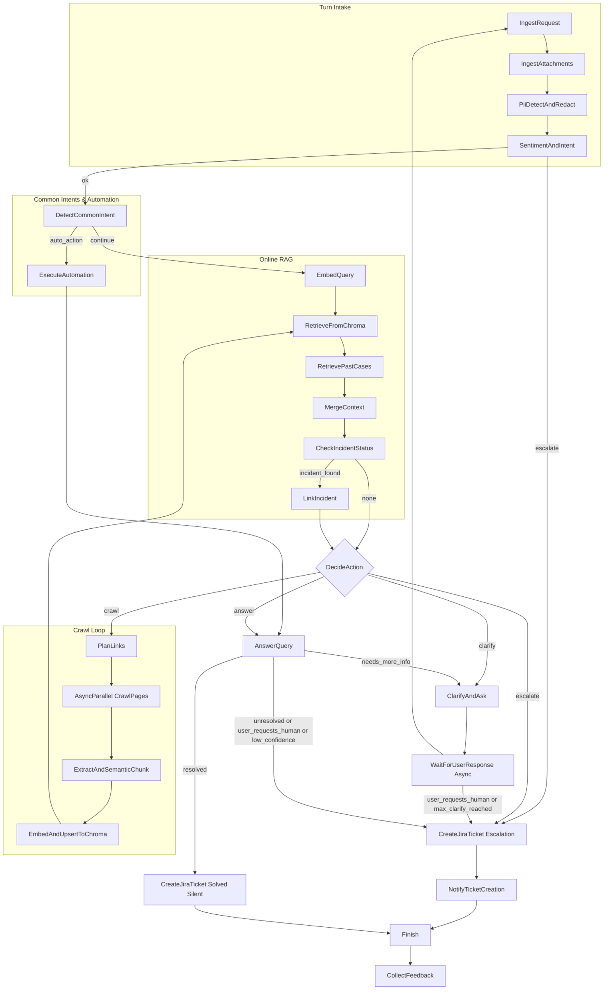

# Design Doc: Agentic IT Support Chatbot

## 1) Requirements

### Problem Statement

Employees and site visitors need instant, accurate IT support answers grounded in an internal knowledge base (RAG) with clear citations. When context is insufficient, the chatbot should proactively expand context by crawling only allowed websites and by accepting and interpreting attachments (e.g., logs, screenshots)—while protecting confidential/PII data via consistent redaction. The bot should ask targeted clarifying questions and guide users through brief troubleshooting checklists; it should also retrieve relevant past cases to suggest proven fixes and adapt tone/complexity to the user. If the user explicitly requests a human, remains dissatisfied/angry, or a broader incident is detected, it should create or update a Jira ticket with a concise summary, what was tried, citations, and any incident linkage, and notify the user. The bot should collect feedback for continuous improvement and propose updates to our knowledge base over time.

Company business case: The bulk of the knowledge base comes from resolved support tickets. A large share of requests follow recurring patterns that don’t require advanced diagnostics and should be auto-routed or automated when safe. Typical categories include:

- Internet/VPN connectivity issues
- Name/password change requests (including automated reset when authorized)
- Employee course questions
- Finding documentation/departments
- Exchanging peripherals
- Peripherals/equipment questions

For these common cases, the agent should quickly classify intent, retrieve the corresponding entry, and either resolve directly, execute approved automations (e.g., password reset), or assign to the appropriate technician queue. Unique or complex cases should be escalated with full context so human technicians can focus on higher-value work.

### Key Capabilities

- RAG over a ChromaDB index with semantic chunking and embeddings.
- Intelligent, agentic crawling when context is insufficient:
  - Start from a configured seed URL.
  - Use Playwright to render JS-heavy pages and collect content.
  - Decide which links to follow iteratively until enough context is found.
- Sentiment and intent analysis of user messages to detect anger/dissatisfaction or a request for a human handoff.
- Automatic Jira ticket creation with context, attempted steps, and citations.
- Served over HTTP (FastAPI). Entire app runs in a container (Docker).
- Multimodal inputs: accept and interpret attachments (text log files, screenshots/images) to better diagnose issues.
- Past case retrieval: retrieve relevant historical tickets/tech logs to surface proven fixes and known issues.
- Confidential information protection: automatically detect and flag/redact confidential/PII data and avoid echoing it back.
- Proactive clarification: ask targeted follow-up questions to gather missing technical details.
- Style adaptation: adapt tone and complexity to the employee’s style/skill while staying professional.
- Troubleshooting checklists: guide employees through simple, structured steps before escalation.
- Ticket controls: auto-create tickets when needed and allow explicit “create ticket” on request; notify when tickets are created.
- Major incident linkage: inform users when their issue matches/links to an ongoing outage/incident (from a status website) and reflect that in tickets.
- Feedback: let users rate helpfulness and use scores for continuous improvement.
- Knowledge freshness: auto-propose SharePoint documentation updates when recurring gaps are detected.

### In-Scope Dependencies (if needed)

- Core: PyYAML, fastapi, uvicorn, python-multipart
- RAG: chromadb
- Crawling: playwright (for browser automation), beautifulsoup4, requests, crawl4ai (optional helper)
- Other: pydantic (FastAPI models), logging

### Assumptions & Constraints

- Allowed domains are configured; the crawler must respect that scope and robots.txt where applicable.
- ChromaDB runs as a separate server (container/service) that this app connects to over the network; persistence configured via env.
- LLM provider is abstracted behind utility functions (model choice can change without code changes here).
- Time and page limits apply to crawling to maintain latency and cost budgets.
- Jira credentials and project key are provided via environment variables.

### User Stories

- As an employee, I ask “How do I reset my VPN password?” and receive a step-by-step answer with citations.
- As a user, if the bot doesn’t find relevant KB entries, it proactively crawls our IT help site and then answers.
- As a frustrated user, I say “This still doesn’t work. I need a human.” and a Jira ticket is filed with the chat transcript, attempted steps, and links used.
- As an admin, I can control seed URLs, allowed domains, top_k retrieval, crawl depth, and rate limits via config.
- As a technician, I want the agent to interpret attached text logs and images to better understand the issue.
- As a technician, I want the agent to retrieve relevant past tickets/logs to suggest likely fixes.
- As a technician, I want the agent to detect and flag confidential information, avoiding relaying it back.
- As a technician, I want the agent to ask targeted questions to collect key technical details.
- As an employee, I want the agent to match my conversational style and knowledge level without becoming unprofessional.
- As a technician, I want the agent to log each action for auditability.
- As a technician, I want automatic ticket creation when the bot can’t resolve issues adequately.
- As an employee, I want the option to explicitly ask the bot to create a ticket.
- As a technician, I want employees to follow a simple checklist the bot provides to self-resolve when possible.
- As an employee, I want to be notified when the bot created a ticket and get a link/ID.
- As an employee, I want to be informed if my issue is linked to a broader outage/problem.
- As an employee, I want to rate the bot’s helpfulness.
- As a technician, I want the bot to update a ticket if it’s part of a broader problem.
- As a technician, I want the bot to automatically propose updates to SharePoint documentation.
- As a technician, I want the bot to redact confidential information in all outward artifacts (logs, tickets).

### Non-Functional

- Latency: first-token < 3s typical when answer found in RAG; crawl path can extend to tens of seconds but bounded.
- Reliability: node-level retries; graceful fallbacks; clear stop conditions.
- Observability: structured logs; trace IDs across nodes.
- Security: restrict crawler to allowed domains; redact secrets; adhere to robots.txt if configured.
- Integrations: access active tickets via Jira (read/update) not only create.
- Channel: accessed on a new SharePoint page (embedding the chat UI).
- Knowledge source: SharePoint (pages/lists) is a primary knowledge base; RAG over SharePoint contents + crawled sites.
- Language: English for conversations and technician log files (company language at Stibo).
- Professionalism: style adaptation must not lead to inappropriate workplace communication.

---

## 2) Applicable Design Patterns

- Agent: Decide next action (answer / crawl / escalate) based on context.
- RAG: Retrieve relevant chunks from ChromaDB to ground answers.
- Workflow: Deterministic stages (ingest -> retrieve -> decide -> answer or crawl -> loop -> answer -> sentiment/escalate).
- Batch + Async + Parallel: Crawl multiple links concurrently using AsyncParallelBatchNode/Flow.

---

## 3) Flow High-Level Design

At a high level, the chatbot follows this loop:

1. Ingest request and normalize context
2. Embed query and retrieve from ChromaDB
3. Agent decides: answer / crawl / escalate
4. If crawl: plan links -> fetch pages (parallel) -> extract & semantic-chunk -> embed & upsert -> loop back to retrieve
5. Generate final answer with citations
6. Sentiment/intent check; optionally create Jira ticket



Stop conditions for the crawl loop: max depth, max pages, time budget, or “enough context” signal from DecideAction.

---

## 4) Utility Functions

> Note: Utilities are external helpers (I/O, APIs). No try/except inside utilities—let Node retries handle errors.

1. call_llm (utils/call_llm.py)

   - Input: messages or prompt (str|list)
   - Output: response text (str)
   - Necessity: All LLM steps (decisions, generation, classification).

2. embed_texts (utils/embedding.py)

   - Input: list[str]
   - Output: list[list[float]]
   - Necessity: Semantic embeddings for queries and chunks.

3. chroma_client (utils/chroma.py)

   - Input: config (host, collection, auth)
   - Output: client handle; methods: upsert, query(top_k), delete
   - Necessity: RAG storage and retrieval.

4. semantic_chunk (utils/chunking.py)

   - Input: page text (str)
   - Output: list[str] semantic chunks (use text semantics, heading structure, similarity-based boundaries)
   - Necessity: Higher-quality chunking vs naive fixed-size; improves retrieval precision.

5. fetch_page_playwright (utils/crawl.py)

   - Input: url (str), timeout, user-agent, cookies (optional)
   - Output: rendered HTML (str), final_url
   - Necessity: JS-heavy sites; Playwright renders reliably.

6. extract_text_and_links (utils/html.py)

   - Input: html (str), base_url
   - Output: text (str), links (list[str])
   - Necessity: Convert to clean text and collect candidate links (BeautifulSoup4).

7. choose_links (utils/link_planner.py)

   - Input: question (str), current hits (snippets), candidate links with context
   - Output: prioritized link plan [{url, reason}] (size N, deduped, filtered by allowed domains)
   - Necessity: Agentic selection of next crawl targets.

8. jira_create_issue (utils/jira.py)

   - Input: project_key, title, description, labels, reporter, attachments(optional)
   - Output: {key, url}
   - Necessity: Human handoff flow.

9. html_to_markdown / markdown_to_text (utils/textio.py)

   - Input: html or markdown
   - Output: markdown or plain text
   - Necessity: Normalization for chunking and context window.

10. rate_limit / semaphore (utils/limits.py)
    - Input: concurrency limit, qps
    - Output: limiter handle
    - Necessity: Prevent overload and rate-limit breaches (crawler & LLM).

Optional: crawl4ai helpers for sitemap, frontier management, dedupe.

11. attachments_ingest (utils/attachments.py)

- Input: list of uploaded files (MIME-aware)
- Output: normalized texts (from .txt/.log), OCR’d text from images, metadata
- Necessity: Multimodal understanding of user-provided context

12. pii_detect (utils/pii.py)

- Input: text
- Output: redaction map and cleaned text
- Necessity: Prevent echoing confidential information; scrub artifacts (answers, logs, tickets)

13. sharepoint_client (utils/sharepoint.py)

- Input: credentials/site ID/list IDs or Graph API config
- Output: fetch/update pages, list items, attachments
- Necessity: Use SharePoint as KB and propose updates

14. past_cases_search (utils/past_cases.py)

- Input: question text, attachments-derived text
- Output: top similar past tickets/logs with summaries
- Necessity: Retrieve institutional memory for better suggestions

15. incident_lookup (utils/incidents.py)

- Input: signals (service name, error signatures), external status feeds
- Output: linked incident/outage info if any
- Necessity: Inform users and link tickets to broader problems

---

## 5) Data Design (Shared Store)

> Use a well-designed shared dict to avoid duplication and keep nodes decoupled.

```python
shared = {
  "config": {
    "seed_url": "https://helpdesk.example.com",
    "allowed_domains": ["example.com"],
    "top_k": 5,
    "max_crawl_depth": 2,
    "max_pages": 20,
    "crawl_timeout_s": 15,
    "concurrency": 5,
    "rag_collection": "it_support",
    "answer_min_relevance": 0.75,
  },

  "user": {
    "id": None,
    "locale": "en",
    "sentiment": None,           # {positive|neutral|negative}
    "wants_human": False,
  },

  "chat": {
    "query": None,
    "history": [],                # previous turns (optional)
    "answer": None,
      "citations": [],              # list of {url, snippet}
      "attachments": [],            # [{filename, mime, text, ocr, sha1}]
      "style": {                    # style guidance per user/turn
         "reading_level": "default",
         "tone": "professional",
      },
      "rating": None,               # user feedback score (e.g., 1-5)
  },

  "retrieval": {
    "q_embedding": None,
    "hits": [],                   # [{chunk, url, score}]
    "enough_context": False,
      "iterations": 0,
  },

  "crawl": {
    "frontier": [],               # list of URLs to visit next
    "visited": set(),             # URLs seen
    "plan": [],                   # [{url, reason}]
    "pages": {},                  # url -> {html, text}
    "new_chunks": [],             # semantic chunks extracted this round
    "embedded": [],               # embeddings parallel to new_chunks
    "depth_map": {},              # url -> depth
  },

  "jira": {
    "should_escalate": False,
    "issue": None,               # {key, url}
      "updates": [],               # history of updates/links to incidents
  },

   "incidents": {
      "linked": None,              # {id, title, status, url}
   },

   "pii": {
      "found": False,
      "redactions": [],            # [{pattern, replacement, scope}]
   },

  "telemetry": {
    "trace_id": None,
    "events": [],                # list of logs/events for debugging
  }
}
```

---

## 6) Node Design

> Types: Regular, BatchNode, AsyncNode, AsyncParallelBatchNode. All steps optional; avoid shared access in exec() per guidelines.

1. IngestRequest (Regular)

   - prep: Read HTTP payload; normalize {user.id, query, locale} into shared["user"], shared["chat"].
   - exec: N/A (or light validation)
   - post: Initialize telemetry trace; return "default".

2. EmbedQuery (Regular)

   - prep: Read shared["chat"]["query"].
   - exec: Compute query embedding.
   - post: Store in shared["retrieval"]["q_embedding"].

3. RetrieveFromChroma (Regular)

   - prep: q_embedding, top_k, collection handle.
   - exec: Query ChromaDB; return hits with scores and metadata (url, title, chunk_id).
   - post: shared["retrieval"]["hits"] = hits.

4. DecideAction (Regular; Agent)

   - prep: Gather question, hits summaries (top_k), thresholds, crawl counters (pages, depth).
   - exec: LLM decides next step; outputs YAML with fields:
     - action: {answer|crawl|escalate}
     - reason: str
     - enough_context: bool
     - desired_links: optional list of candidate URLs when action=crawl
   - post: Set shared["retrieval"]["enough_context"]. If crawl, seed plan/frontier; return action string.

5. GenerateAnswer (Regular)

   - prep: question, top hits (content + metadata), chat history.
   - exec: LLM grounded answer with citations; constrained to use provided context; if insufficient, say so and hint at escalation.
   - post: Store answer and citations in shared["chat"].

6. PlanLinks (Regular)

   - prep: question, current hits, last crawled pages' links (from crawl.pages), allowed_domains, visited, depth_map.
   - exec: choose_links utility ranks links using relevance to the question and novelty; cap to N.
   - post: shared["crawl"]["plan"] and extend frontier with new URLs and depths.

7. CrawlPages (AsyncParallelBatchNode)

   - prep_async: Return iterable of next URLs from frontier (respect depth, limits, allowed domains, not visited).
   - exec_async(item=url): Fetch with Playwright; return {url, html}.
   - post_async: Store html per url in shared["crawl"]["pages"].

8. ExtractAndSemanticChunk (BatchNode)

   - prep: Iterate over newly crawled pages.
   - exec(page): extract_text_and_links -> semantic_chunk(text) -> return {url, chunks, links}.
   - post: Update crawl.pages[url].text; aggregate new_chunks; update frontier with filtered links.

9. EmbedAndUpsertToChroma (BatchNode)

   - prep: shared["crawl"]["new_chunks"].
   - exec(chunk): embed; return (chunk_id, vector, metadata{url})
   - post: Upsert all to Chroma; clear new_chunks; mark index updated.

10. SentimentAndIntent (Regular)

- prep: last user message and conversation snippets.
- exec: LLM classification (angry/dissatisfied? asks for human?).
- post: Set shared["user"]["sentiment"] and ["wants_human"]; set jira.should_escalate accordingly.

11. CreateJiraTicket (Regular)

- prep: question, answer (if any), citations, crawl attempts/plan, relevant errors.
- exec: jira_create_issue; title derived from question; description includes what was tried and links.
- post: Store issue metadata in shared["jira"]["issue"].

12. Finish (Regular)

- prep/exec: N/A
- post: Finalize response payload for API; add telemetry.

### Transitions

- IngestRequest >> EmbedQuery >> RetrieveFromChroma >> DecideAction
- DecideAction - "answer" >> GenerateAnswer >> SentimentAndIntent
- DecideAction - "crawl" >> PlanLinks >> CrawlPages >> ExtractAndSemanticChunk >> EmbedAndUpsertToChroma >> RetrieveFromChroma >> DecideAction
- DecideAction - "escalate" >> CreateJiraTicket >> Finish
- SentimentAndIntent - "escalate" >> CreateJiraTicket >> Finish
- SentimentAndIntent - "ok" >> Finish

13. IngestAttachments (BatchNode)

- prep: read uploaded files metadata from request payload
- exec: normalize text logs; OCR images; compute hashes; limit sizes
- post: store normalized texts into chat.attachments; emit events

14. PiiDetectAndRedact (Regular)

- prep: combine question + attachment texts
- exec: run pii_detect; produce redaction map and cleaned text
- post: set pii flags; replace sensitive spans in downstream prompts and artifacts

15. RetrievePastCases (Regular)

- prep: build query from question + attachment signals
- exec: past_cases_search across Jira/tech logs
- post: add summaries into retrieval.hits with lower priority than live RAG

16. ClarifyQuestion (Regular)

- prep: analyze missing fields (OS, device, error codes) and confidence
- exec: generate 1-3 targeted follow-up questions
- post: if needed, return action "clarify" causing a short loop to gather answers

17. TroubleshootingChecklist (Regular)

- prep: based on problem category (e.g., VPN, email)
- exec: produce a short checklist (3–7 steps)
- post: present steps; gather confirmations; proceed or escalate

18. IncidentCheck (Regular)

- prep: extract product/service, error signatures
- exec: incident_lookup; detect outages
- post: set incidents.linked and possibly return action "inform_outage"

19. NotifyTicketCreated (Regular)

- prep: jira.issue
- exec/post: send a concise confirmation with link/ID; write to chat history

20. UpdateTicketIfBroader (Regular)

- prep: jira.issue and incidents.linked
- exec: add relation/comment to ticket; push status updates
- post: append jira.updates

21. SharePointUpdateProposal (Regular)

- prep: identify repeated missing info across similar issues
- exec: draft a doc update (PR-like suggestion)
- post: store proposal or call sharepoint_client to create a draft

### Edge Cases & Guards

- Crawl limits: max_depth, max_pages, time budget; short-circuit when enough_context=True.
- Robots.txt honored if enabled; disallow external domains.
- Duplicate URLs and content dedupe.
- Non-HTML content (PDF): skip or convert later (out-of-scope initial version).
- Jira failures: fall back to instruct user to contact support email; keep transcript in logs.
- Attachments: size/type limits; ignore unsupported formats gracefully.
- PII: redactions applied consistently across prompts, logs, tickets, and responses.
- Clarification loops: cap number of follow-up interactions to avoid fatigue.

---

## 7) API Surface (FastAPI)

- POST /chat: {user_id, query, locale?, history?, attachments?} -> {answer, citations, escalated?, jira_issue?, rating?}
- GET /health: readiness/liveness

Notes:

- Support multipart/form-data for attachments (text logs, images). Perform OCR for images server-side.
- Add an optional feedback endpoint or include rating in a follow-up POST to persist scores.
- Provide a flag to explicitly request ticket creation from the UI.

Use python-multipart for potential file uploads in future (e.g., screenshots). Responses include citations and trace_id for debugging.

---

## 8) Containerization & Runtime

- Packaging: Docker
- Base image: python:3.13.7-slim; install Playwright and deps (chromium).
- Run server via uvicorn (FastAPI) in the container.
- Environment variables:
  - CHROMA_HOST/PORT/COLLECTION
  - JIRA_BASE_URL, JIRA_EMAIL, JIRA_API_TOKEN, JIRA_PROJECT_KEY
  - ALLOWED_DOMAINS, SEED_URL, MAX_DEPTH, MAX_PAGES, TOP_K
  - LLM_PROVIDER/MODEL and API credentials as needed
  - SHAREPOINT\_\* (tenant/client IDs or Graph scopes), OCR toggle, PII policy toggles
- Ports: expose 8000 by default.
- ChromaDB: separate server/container. Configure via env: CHROMA_HOST, CHROMA_PORT, CHROMA_COLLECTION.

---

## 9) Reliability, Observability, and Limits

- Retries: Enable Node max_retries where relevant (LLM, network I/O) with backoff wait.
- Fallbacks: exec_fallback to return clear messages rather than raising.
- Concurrency: semaphore for Playwright sessions; configurable.
- Logging: structured JSON logs; include trace_id and node name.
- Tests: unit tests for utilities (HTML extraction, link selection), flow tests for happy path and crawl loop, sentiment classification edge cases.

---

## 10) Initial Milestones

1. Skeleton FastAPI service wiring for basic RAG-only Q&A.
2. Add Playwright crawler subflow with semantic chunking and Chroma upsert; loop back to answer.
3. Add sentiment/intent checkpoint and Jira integration.
4. Containerize with Dockerfile; verify headless browser works in container; document env vars.
5. Hardening: limits, logging, tests, and basic dashboards.
6. Add attachments ingestion (logs/images) and OCR with PII detection/redaction.
7. Integrate past case retrieval and incident linkage; add ticket update/notification nodes.
8. Add troubleshooting checklist and clarification loops; add feedback ratings.

---

## 11) Out of Scope (v1)

- Parsing binary formats (PDF/Office docs) — can be added later.
- Multi-language summarization beyond simple locale hints.
