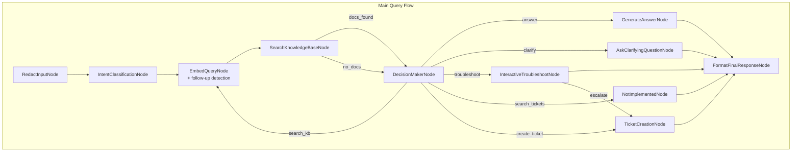

# Design Doc: IT Support Chatbot

## 1. Requirements

### Problem Statement

IT support teams face repetitive inquiries about common issues (password resets, VPN setup, printer troubleshooting) that consume significant time. Employees often struggle to find relevant documentation or articulate their problems effectively, leading to unnecessary ticket creation and delayed resolution.

### Solution

An **Agentic IT Support Chatbot** that:

- Answers factual IT questions using a local knowledge base (RAG with ChromaDB)
- Guides employees through interactive troubleshooting workflows
- Monitors company network status page for ongoing incidents
- Redacts sensitive information from user inputs before processing
- Maintains conversation context across multi-turn interactions
- Operates with privacy-first principles (local embeddings, no sensitive data to external APIs)
- Provides OS-specific guidance based on user's operating system
- Supports document upload and indexing via API
- Includes observability via Langfuse tracing integration

### User Stories

1. **Quick Answer**: "As an employee, I want to quickly get answers to common IT questions without creating a ticket."

   - Example: "What is our VPN connection procedure?"
   - Expected: Bot retrieves relevant documentation and provides step-by-step instructions.

2. **Interactive Troubleshooting**: "As an employee with a printer issue, I want guided troubleshooting steps."

   - Example: "My printer won't print."
   - Expected: Bot asks diagnostic questions, provides solutions, tracks progress.

3. **Network Status Check**: "As an employee, I want to know if my issue is part of a widespread problem."

   - Example: "Is there a network outage?"
   - Expected: Bot checks company status page and informs about known service disruptions.

4. **Ticket Creation**: "As an employee with an unresolved issue, I want the bot to create a properly formatted ticket."

   - Example: After failed troubleshooting, bot offers to create ticket with collected context.
   - Expected: Bot creates Jira ticket with conversation history, troubleshooting steps, and system info.

5. **Privacy Protection**: "As an IT admin, I want sensitive information redacted from logs and tickets."

   - Expected: Bot automatically redacts passwords, API keys, personal data before logging.

6. **Document Upload**: "As an IT admin, I want to upload new documentation to the knowledge base."
   - Example: Upload PDF or HTML files via API endpoint.
   - Expected: Documents are parsed, chunked, embedded, and indexed into ChromaDB.

### Success Criteria

- **Deflection Rate**: 40%+ of queries resolved without ticket creation
- **Response Time**: < 3 seconds for factual queries, < 10 seconds for RAG retrieval
- **User Satisfaction**: 80%+ positive feedback on bot interactions
- **Privacy Compliance**: Zero sensitive data leaks to external LLM APIs

---

## 2. Flow Design

> Notes for AI:
>
> 1. Consider the design patterns of agent, map-reduce, rag, and workflow. Apply them if they fit.
> 2. Present a concise, high-level description of the workflow.

### Applicable Design Patterns

1. **Agent Pattern**: The DecisionMakerNode uses agentic decision-making to route between different actions (answer, clarify, troubleshoot, search_kb, search_tickets, create_ticket).

2. **RAG Pattern**:

   - **Offline**: Ingest IT documentation → Chunk (semantic) → Embed (local model) → Store in ChromaDB
   - **Online**: User query → Embed → Retrieve top-k documents → Generate answer

3. **Workflow Pattern**: Interactive troubleshooting follows a sequential workflow with user feedback loops.

### Flow High-Level Design

The system has four main flows:

1. **QueryFlow**: Main query answering flow with agent routing
2. **IndexingFlow**: Offline document indexing for RAG
3. **SimpleQueryFlow**: Simplified flow for testing (direct search → answer)
4. **NetworkStatusFlow**: Async flow for checking company status page

#### Follow-Up Context Strategy

To handle multi-turn conversations correctly (e.g., "how to find mac address" → "im on linux"), the **`EmbedQueryNode`** handles follow-up detection locally (no LLM needed):

1. **Active Topic Tracking**: `conversation_memory` stores the last answered topic
2. **Follow-up Detection**: Short queries (≤5 words) with OS/version/confirmation words are detected as follow-ups
3. **Query Enrichment**: Follow-ups are enriched with topic context (e.g., "im on linux" → "how to find mac address - im on linux")
4. **Fallback**: If no active topic, extract IT terms from conversation history

This prevents the system from misinterpreting context switches and ensures continuity.




### Detailed Node Flow

#### Main Query Flow Nodes:

1. **RedactInputNode**

   - Redacts sensitive information (passwords, API keys, tokens) from user input
   - Stores redacted query for all downstream processing

2. **IntentClassificationNode**

   - Classifies query intent: **informative** (seeking information) or **troubleshooting** (has a problem to fix)
   - Extracts keywords for search optimization
   - Intent influences DecisionMaker routing (troubleshooting intent biases toward troubleshoot action)

3. **EmbedQueryNode**

   - Generates embedding for user query using local sentence-transformers
   - Retries up to 3 times on failure

4. **SearchKnowledgeBaseNode**

   - Queries ChromaDB with query embedding
   - Filters results by minimum score threshold
   - Returns "docs_found" or "no_docs" action

5. **DecisionMakerNode** (Agent)

   - Context: user_query, user_os, intent, conversation_history, retrieved_docs, network_status
   - Actions: `search_kb`, `troubleshoot`, `search_tickets`, `create_ticket`, `answer`, `clarify`
   - Returns action name to route flow

6. **GenerateAnswerNode**

   - Formats answer using LLM (Groq API)
   - Uses retrieved docs as context
   - Provides OS-specific instructions

7. **AskClarifyingQuestionNode**

   - Generates specific clarifying questions when query is ambiguous
   - Avoids redundant questions based on conversation history

8. **InteractiveTroubleshootNode**

   - Detects user intent changes (exit, continue, escalate)
   - Provides diagnostic reasoning and OS-specific steps
   - Tracks troubleshooting state and failed steps

9. **FormatFinalResponseNode**

   - Formats final response and saves to conversation memory

10. **TicketCreationNode**

- Creates Jira support ticket with full conversation context
- Checks for duplicate tickets to avoid unnecessary escalations
- Generates LLM-powered ticket summaries and descriptions
- Auto-closes tickets if issue was resolved during troubleshooting

11. **NotImplementedNode**
    - Placeholder for ticket search feature (not yet implemented)

#### Offline Indexing Flow:

```
LoadDocumentsNode → ChunkDocumentsNode → EmbedDocumentsNode → StoreInChromaDBNode
```

- **LoadDocumentsNode**: Loads .txt, .md, .html, .pdf files from source directory
- **ChunkDocumentsNode** (BatchNode): Semantic chunking with embedding-based coherence
- **EmbedDocumentsNode** (BatchNode): Generates embeddings for each chunk
- **StoreInChromaDBNode**: Inserts chunks and embeddings into ChromaDB

---

## 3. Utility Functions

> Notes for AI:
>
> 1. Understand the utility function definition thoroughly by reviewing the doc.
> 2. Include only the necessary utility functions, based on nodes in the flow.

### Implemented Utilities

1. **Call LLM** (`utils/call_llm_groq.py`)

   - **Input**: `prompt: str`, `max_tokens: int = 1024`
   - **Output**: `response: str`
   - **Necessity**: Used by most nodes for LLM-based tasks (answer generation, decision making)
   - **Implementation**: Uses Groq API with configurable model
   - **Environment Variables**: `GROQ_API_KEY`, `GROQ_MODEL`

2. **Get Embedding** (`utils/embedding_local.py`)

   - **Input**: `text: str`
   - **Output**: `vector: List[float]` (384-dim for all-MiniLM-L6-v2)
   - **Necessity**: Used for query embedding and document indexing
   - **Implementation**: Uses sentence-transformers with model caching
   - **Environment Variables**: `EMBED_MODEL`

3. **Intent Classifier** (`utils/intent_classifier.py`)

   - **Input**: `query: str`
   - **Output**: `str` - Returns intent type: "informative" or "troubleshooting"
   - **Necessity**: Helps DecisionMaker route queries appropriately
   - **Implementation**: Rule-based binary classification using frozenset keyword matching
   - **Intent Definitions**:
     - `informative`: User wants information, explanations, how-to guides, contact info
     - `troubleshooting`: User has a problem/error they need help fixing
   - **Additional Functions**: `extract_keywords()`, `is_greeting()`, `is_farewell()`

4. **Conversation Memory** (`utils/conversation_memory.py`)

   - **Input**: `session_id: str`, operations (add_message, get_history, set_workflow_state)
   - **Output**: Session data, conversation history, workflow state
   - **Necessity**: Maintains context across multi-turn conversations
   - **Implementation**: In-memory session store with workflow tracking and cleanup

5. **ChromaDB Client** (`utils/chromadb_client.py`)

   - **Input**: Various (query_vector, document_chunks, metadata)
   - **Output**: Search results, insertion confirmations
   - **Necessity**: Interface for vector database operations
   - **Functions**:
     - `initialize_client()` - Creates ChromaDB client (server or persistent mode)
     - `get_collection()` - Gets or creates collection with cosine similarity
     - `insert_documents()` - Inserts chunks with embeddings and metadata
     - `query_collection()` - Queries collection with embedding vector
     - `delete_documents_by_source()` - Deletes documents by source file
     - `get_collection_stats()` - Returns collection statistics
   - **Environment Variables**: `CHROMADB_MODE`, `CHROMADB_HOST`, `CHROMADB_PORT`, `CHROMADB_COLLECTION`, `CHROMADB_PERSIST_DIR`

6. **Document Chunker** (`utils/chunker.py`)

   - **Input**: `text: str, chunk_size: int, chunk_overlap: int`
   - **Output**: `List[str]` (text chunks)
   - **Necessity**: Breaks large documents into embeddable chunks
   - **Implementation**: Semantic chunking using spaCy sentence tokenization and embedding similarity
   - **Functions**:
     - `chunk_text()` - Main chunking function
     - `semantic_chunk_sentences()` - Groups sentences by semantic coherence
     - `truncate_to_token_limit()` - Truncates text to token limit
   - **Environment Variables**: `INGESTION_CHUNK_SIZE`, `INGESTION_CHUNK_OVERLAP`, `INGESTION_SIMILARITY_THRESHOLD`, `SPACY_MODEL`

7. **Redactor** (`utils/redactor.py`)

   - **Input**: `text: str, patterns: tuple[str, ...]`
   - **Output**: `redacted_text: str`
   - **Necessity**: Removes sensitive information before logging/processing
   - **Patterns**: API keys, passwords, tokens, AWS keys, private keys
   - **Functions**:
     - `redact_text()` - Redacts patterns from text
     - `redact_dict()` - Recursively redacts dictionary values
     - `is_sensitive()` - Checks if text contains sensitive data
     - `get_redaction_summary()` - Reports what was redacted

8. **Document Parser** (`utils/document_parser.py`)

   - **Input**: `filepath: str`
   - **Output**: `{"text": str, "metadata": dict}`
   - **Necessity**: Parses various document formats for indexing
   - **Supported Formats**: .pdf (with pdfplumber), .html/.htm (with BeautifulSoup)
   - **Classes**:
     - `PDFParser` - Extracts text with formatting from PDFs
     - `HTMLParser` - Extracts text from HTML with style preservation

9. **Status Retrieval** (`utils/status_retrieval.py`)

   - **Input**: None (reads from company status page)
   - **Output**: `List[Dict]` with event titles and messages
   - **Necessity**: Checks company network status for ongoing incidents
   - **Implementation**: Uses Playwright for async web scraping
   - **Functions**:
     - `scrape_session()` - Main async scraping function
     - `format_status_results()` - Formats results for display

10. **Ticket Manager** (`utils/ticket_manager.py`)
    - **Input**: Ticket dict, conversation history, session context
    - **Output**: Jira ticket link or local file path
    - **Necessity**: Creates support tickets in Jira with full conversation context
    - **Implementation**: Uses Jira REST API v2 with Bearer token authentication
    - **Functions**:
      - `create_jira_issue(ticket: Dict) -> Optional[Dict]` - Creates ticket via REST API
      - `write_ticket(ticket: Dict, conversation_history: List) -> Dict` - Saves locally + creates in Jira
      - `add_attachment(log_file: Path, issue_key: str) -> bool` - Attaches conversation log
      - `find_existing_ticket(shared: Dict, history: List) -> Optional[Dict]` - Prevents duplicates
      - `close_issue(ticket_id: str) -> bool` - Auto-closes resolved tickets
    - **Environment Variables**: `JIRA_URL`, `PROJECT_KEY`, `AIS_API_TOKEN`
    - **Graceful Degradation**: Falls back to local ticket storage if Jira API unavailable
    - **Exception Handling Design** (INTENTIONAL):
      - All Jira API functions use `try/except` blocks that return `None`/`False` on failure
      - This is **correct and intentional** - implements graceful degradation pattern
      - Local ticket storage is the critical function (never fails)
      - Jira integration is best-effort enhancement (may fail due to network, auth, downtime)
      - Functions are NOT called directly from `Node.exec()`, so Node retry mechanism is not needed
      - Called from `write_ticket()` → `TicketCreationNode.exec()` → always returns dict for `post()`
      - This pattern allows system to continue working when Jira is down (better UX)
      - Retrying Jira calls would waste API quota and time (inappropriate for this use case)

---

## 4. Data Design

> Notes for AI: Try to minimize data redundancy

### Shared Store Schema

The shared store uses an in-memory dictionary structure for real-time operations, with ChromaDB for persistent knowledge storage.

```python
shared = {
    # Session Context
    "session_id": "uuid-string",
    "user_os": "windows",  # User's operating system for tailored responses

    # Input Processing
    "original_query": "My VPN keeps disconnecting, password is abc123",
    "user_query": "My VPN keeps disconnecting, password is [REDACTED]",  # After redaction
    "had_sensitive_data": True,  # Flag if redaction occurred
    "redaction_notice": "Your message contained sensitive data that was removed for security.",

    # Intent Classification (binary)
    "intent": "troubleshooting",  # String: "informative" or "troubleshooting"

    # Conversation State (from ConversationMemory)
    "conversation_history": [
        {"role": "user", "content": "...", "timestamp": "..."},
        {"role": "assistant", "content": "...", "timestamp": "..."}
    ],

    # Network Status Results (from StatusQueryNode)
    "status_results": [
        {"title": "Network Outage - Building A", "message": "Investigation in progress"}
    ],

    # RAG Results
    "query_embedding": [0.123, 0.456, ...],  # 384-dim vector
    "retrieved_docs": [
        {
            "id": "doc-123",
            "content": "VPN troubleshooting steps...",
            "metadata": {
                "source_file": "vpn_guide.md",
                "category": "networking"
            },
            "score": 0.92
        }
    ],

    # Decision Making (Agent Loop)
    "decision": "answer",  # search_kb | answer | clarify | troubleshoot | not_implemented
    "search_count": 0,  # Tracks number of KB searches (max 3)

    # Troubleshooting State (from ConversationMemory workflow_state)
    "troubleshoot_state": {
        "issue": "VPN disconnection",
        "steps": [
            "Check internet connection",
            "Restart VPN client",
            "Check firewall settings"
        ],
        "current_step_index": 1,
        "status": "in_progress"  # in_progress | resolved | failed
    },

    # Final Response
    "response": "Based on the documentation, here are the steps...",
    "needs_input": False,  # True if waiting for user response
    "is_clarifying": False,  # True if asking clarifying question
}
```

### ChromaDB Schema

**Collection Name**: `it_support_docs` (from env: `CHROMADB_COLLECTION`)

**Document Structure**:

```python
{
    "id": "source_file-chunk_index",  # e.g., "vpn_guide.md-0"
    "embedding": [0.123, 0.456, ...],  # 384-dim vector
    "document": "Text content of the chunk",
    "metadata": {
        "source_file": "vpn_setup_guide.md",
        "chunk_index": 0,
        "title": "VPN Setup Guide",  # Extracted from document
        "indexed_at": "2025-01-15T10:30:00Z"
    }
}
```

### Conversation Memory Schema

Managed by `ConversationMemory` class in `utils/conversation_memory.py`:

```python
session_data = {
    "session_id": "uuid",
    "created_at": "ISO timestamp",
    "last_activity": "ISO timestamp",
    "conversation_history": [
        {"role": "user", "content": "...", "timestamp": "..."},
        {"role": "assistant", "content": "...", "timestamp": "..."}
    ],
    "workflow_state": {
        "issue": "VPN problem",
        "steps": ["step 1", "step 2"],
        "current_step_index": 0,
        "status": "in_progress"
    }
}
```

---

## 5. Node Design

> Notes for AI: Carefully decide whether to use Batch/Async Node/Flow.

### Shared Store Access Patterns

All nodes follow the pattern: **Read in `prep()` → Process in `exec()` → Write in `post()`**

### Main Query Flow Nodes

---

#### 1. RedactInputNode

- **Purpose**: Remove sensitive data (passwords, tokens, API keys) from user input before processing
- **Type**: Regular Node (no retries needed - redaction is deterministic)
- **Utility Used**: `utils/redactor.py` - `redact_text()`
- **Steps**:
  - **prep**:
    - Read `shared["user_query"]` (raw user input)
    - Read `shared["session_id"]` for logging
    - Return as dict for exec
  - **exec**:
    - Call `redact_text(query)` utility function
    - Compare original vs redacted to detect if sensitive data was found
    - Return `{"redacted_query": str, "had_sensitive_data": bool}`
  - **post**:
    - Store original in `shared["original_query"]` (for audit trail)
    - **Overwrite** `shared["user_query"]` with redacted version (protects downstream nodes)
    - Set `shared["had_sensitive_data"]` flag
    - If redaction occurred, add `shared["redaction_notice"]` warning message
    - Return `"default"`

**Rationale**: Runs first to ensure all downstream nodes work with sanitized input. Prevents sensitive data from being logged or sent to LLM APIs.

---

#### 2. IntentClassificationNode

- **Purpose**: Classify user query intent to help DecisionMaker route appropriately
- **Type**: Regular Node (no retries - classification is fast and deterministic)
- **Utility Used**: `utils/intent_classifier.py` - `classify_intent()`, `extract_keywords()`
- **Steps**:
  - **prep**:
    - Read `shared["user_query"]` (already redacted from previous node)
    - Return query string
  - **exec**:
    - Call `classify_intent(query)` - returns "informative" or "troubleshooting"
    - Call `extract_keywords(query)` - returns list of IT-related keywords
    - Return `{"intent": str, "keywords": List[str]}`
  - **post**:
    - Write `shared["intent"]` (used by DecisionMaker for routing bias)
    - Write `shared["keywords"]` (used for search query expansion)
    - Return `"default"`

**Intent Definitions**:

- **informative**: User wants information, how-to guides, explanations (e.g., "How do I set up VPN?")
- **troubleshooting**: User has a problem/error to fix (e.g., "My VPN keeps disconnecting")

---

#### 3. EmbedQueryNode

- **Purpose**: Generate embedding vector for semantic search in knowledge base
- **Type**: Regular Node
- **Max Retries**: 3 (embedding model can occasionally fail)
- **Wait**: 0 seconds (no rate limiting on local model)
- **Utility Used**: `utils/embedding_local.py` - `get_embedding()`
- **Steps**:
  - **prep**:
    - Read `shared["user_query"]` (redacted query)
    - Read `shared["session_id"]` for conversation memory lookup
    - Read `shared.get("keywords", [])` from intent classification
    - Get conversation history from `conversation_memory.get_history(session_id)`
    - Detect follow-up queries (short queries in multi-turn context)
    - Return enriched query context
  - **exec**:
    - **Follow-up Detection**: If query is short (≤5 words) and has active topic in memory, enrich query with topic context
    - Call `get_embedding(query_with_context)` utility
    - Validates embedding is non-zero (384-dim vector for all-MiniLM-L6-v2)
    - Return embedding vector as `List[float]`
  - **post**:
    - Write `shared["query_embedding"]` (used by SearchKnowledgeBaseNode)
    - Write `shared["enriched_query"]` if follow-up was detected
    - Return `"default"`

**Follow-up Handling**: Prevents context loss in multi-turn conversations (e.g., "how to find mac address" → "im on linux")

---

#### 4. SearchKnowledgeBaseNode

- **Purpose**: Retrieve relevant documents from ChromaDB using vector similarity search
- **Type**: Regular Node
- **Max Retries**: 2 (ChromaDB queries can occasionally timeout)
- **Wait**: 1 second
- **Utility Used**: `utils/chromadb_client.py` - `query_collection()`, `utils/reranker.py` - `rerank_results()`
- **Steps**:
  - **prep**:
    - Read `shared["query_embedding"]` (384-dim vector)
    - Read `shared["user_query"]` (text for reranking)
    - Read `shared.get("search_count", 0)` (prevent infinite loops)
    - Validate embedding is non-zero
    - Return as dict
  - **exec**:
    - **Step 1 - Vector Search**: Query ChromaDB with embedding, fetch `top_k * 3` candidates (e.g., 15 results)
    - **Step 2 - Light Filtering**: Remove very low scores (threshold: `min_score * 0.7`)
    - **Step 3 - Neighbor Expansion**: For top result (if score > 0.75), fetch adjacent chunks for context continuity
      - ⚠️ **IMPORTANT**: Neighbors are added BEFORE reranking to ensure all chunks get reranked together
      - This prevents neighbors from missing `rerank_score` field and getting buried by feedback adjustments
    - **Step 4 - Reranking**: Use cross-encoder to rerank ALL candidates (including neighbors) based on query-document relevance
      - All chunks now have consistent `rerank_score` field
    - **Step 5 - Feedback Adjustment**: Apply user feedback scores to boost/penalize documents, then re-sort
    - Return final top-k documents with scores and metadata
  - **post**:
    - Write `shared["retrieved_docs"]` (list of dicts with content, metadata, scores)
    - Increment `shared["search_count"]` (tracks iterations)
    - If docs found, return `"docs_found"`, else return `"no_docs"`

**Search Strategy**: Two-stage retrieval (vector search + reranking) ensures high relevance while maintaining speed.

---

#### 5. DecisionMakerNode (Agent)

- **Purpose**: Decide next action based on context (implements Agent design pattern)
- **Type**: Regular Node (Agent pattern)
- **Max Retries**: 2
- **Wait**: 1 second (rate limiting on LLM API)
- **Utility Used**: `utils/call_llm_groq.py` - `call_llm()`, `utils/prompts.py` - decision prompts
- **Steps**:
  - **prep**:
    - Read comprehensive context:
      - `shared["user_query"]`, `shared["user_os"]`, `shared["intent"]`
      - `shared["retrieved_docs"]`, `shared.get("status_results", [])`
      - Conversation history from memory
      - `shared.get("search_count", 0)`, `shared.get("turn_count", 1)`
      - Troubleshooting state if in workflow
    - Format RAG context from retrieved docs
    - Build full decision context dict
    - Return context
  - **exec**:
    - **Policy Check**: Evaluate confidence thresholds:
      - Low doc confidence → bias toward "clarify"
      - High doc confidence + troubleshooting intent → bias toward "troubleshoot"
      - Rate limit errors → special handling
    - Build decision prompt with:
      - Context (query, intent, OS, history, docs, status)
      - Action space (search_kb, answer, clarify, troubleshoot, search_tickets, create_ticket)
      - Decision rules (max searches, confidence thresholds)
    - Call LLM with structured YAML output format
    - Parse YAML response to extract action and reasoning
    - Validate action is in allowed set
    - Return `{"action": str, "reasoning": str}`
  - **post**:
    - Write `shared["decision"]` (stores reasoning for audit)
    - Write `shared["decision_reasoning"]` (for debugging)
    - **Return action string** (routes flow to appropriate node)

**Action Space**:

- `search_kb`: Loop back to embed/search with refined query
- `answer`: Generate answer from retrieved docs (→ GenerateAnswerNode)
- `clarify`: Ask clarifying question (→ AskClarifyingQuestionNode)
- `troubleshoot`: Start interactive troubleshooting (→ InteractiveTroubleshootNode)
- `search_tickets`: Search Jira tickets (→ NotImplementedNode - planned)
- `create_ticket`: Create support ticket (→ TicketCreationNode)

**Safety**: Max search iterations (3), max conversation turns (20), escalation on failures.

---

#### 6. GenerateAnswerNode

- **Purpose**: Generate final answer using retrieved documents as context
- **Type**: Regular Node
- **Max Retries**: 2
- **Wait**: 1 second
- **Utility Used**: `utils/call_llm_groq.py` - `call_llm()`
- **Steps**:
  - **prep**:
    - Read `shared["user_query"]`, `shared["user_os"]`
    - Read `shared["retrieved_docs"]` (RAG context)
    - Read conversation history from memory
    - Read `shared.get("redaction_notice")` if sensitive data was removed
    - Format RAG context with doc contents and metadata
    - Build answer generation prompt
    - Return context dict
  - **exec**:
    - Build prompt with:
      - System role (IT support agent)
      - User query and OS
      - Retrieved documentation context
      - Conversation history for continuity
      - Instructions for OS-specific guidance
      - URL formatting rules
    - Call LLM with max_tokens=1024
    - Validate response is non-empty
    - Return answer string
  - **post**:
    - Write `shared["response"]` (final answer)
    - If redaction_notice exists, prepend warning to response
    - Set `shared["is_clarifying"] = False`
    - Return `"default"`

**Answer Quality**: Uses retrieved docs as authoritative source, avoids hallucination by grounding in documentation.

---

#### 7. AskClarifyingQuestionNode

- **Purpose**: Ask specific clarifying questions when query is ambiguous
- **Type**: Regular Node
- **Max Retries**: 2
- **Wait**: 1 second
- **Utility Used**: `utils/call_llm_groq.py` - `call_llm()`
- **Steps**:
  - **prep**:
    - Read `shared["user_query"]`, `shared["intent"]`
    - Read `shared["retrieved_docs"]` (partial matches)
    - Read conversation history to avoid redundant questions
    - Return context dict
  - **exec**:
    - Build clarification prompt with:
      - User's original question
      - Retrieved doc summaries (what was found)
      - What information is missing
      - Conversation history (don't ask what's already known)
      - Instructions to ask ONE specific question
    - Call LLM
    - Validate question format (no generic "Can you provide more details?")
    - Return clarifying question
  - **post**:
    - Write `shared["response"]` (question for user)
    - Set `shared["is_clarifying"] = True` (signals UI to show input field)
    - Set `shared["needs_input"] = True`
    - Return `"default"`

**Clarification Strategy**: Asks specific, actionable questions (e.g., "Which operating system are you using?" not "Can you clarify?")

---

#### 8. InteractiveTroubleshootNode

- **Purpose**: Guide user through step-by-step troubleshooting with progress tracking
- **Type**: Regular Node
- **Max Retries**: 2
- **Wait**: 1 second
- **Utility Used**: `utils/call_llm_groq.py` - `call_llm()`, `utils/conversation_memory.py` - workflow state
- **Steps**:
  - **prep**:
    - Read `shared["user_query"]`, `shared["user_os"]`
    - Read `shared["retrieved_docs"]` (troubleshooting guides)
    - Read conversation history
    - **Load workflow state** from `conversation_memory.get_workflow_state(session_id)`
    - Determine if starting new workflow or continuing existing
    - Return context dict with workflow state
  - **exec**:
    - **Intent Detection**: Parse user response for exit/escalate/continue signals
      - "exit", "stop", "never mind" → exit workflow
      - "doesn't work", "still broken" → escalate to ticket creation
      - Otherwise → continue to next step
    - **Step Generation** (if new workflow):
      - Call LLM to create 3-5 troubleshooting steps based on issue and docs
      - Format with OS-specific commands/instructions
    - **Step Progression** (if continuing):
      - Advance to next step
      - Track failed steps (for escalation threshold)
      - Format current step with clear instructions
    - Call LLM to generate friendly response with current step
    - Return `{"response": str, "workflow_state": dict, "action": str}`
  - **post**:
    - Write `shared["response"]` (current troubleshooting step)
    - **Update workflow state** in conversation memory:
      - Current step index
      - Failed step count
      - Issue description
      - Steps list
    - Set `shared["needs_input"] = True` (wait for user feedback)
    - Set `shared["in_troubleshoot"] = True`
    - Return action: `"default"`, `"exit"`, or `"escalate"`

**Workflow Tracking**: Maintains state across turns, escalates to ticket creation after N failed steps.

---

#### 9. FormatFinalResponseNode

- **Purpose**: Format response with metadata for consistent API output
- **Type**: Regular Node (no retries - formatting is deterministic)
- **Utility Used**: None (pure formatting)
- **Steps**:
  - **prep**:
    - Read `shared["response"]` (text from previous node)
    - Read `shared.get("is_clarifying", False)`
    - Read `shared.get("needs_input", False)`
    - Read `shared.get("had_sensitive_data", False)`
    - Read `shared.get("session_id")`
    - Return dict with all flags
  - **exec**:
    - Compile response object:
      ```python
      {
        "answer": response_text,
        "needs_input": bool,
        "is_clarifying": bool,
        "had_sensitive_data": bool,
        "session_id": str
      }
      ```
    - No LLM call - pure data transformation
    - Return formatted response
  - **post**:
    - **Save to conversation memory**: `conversation_memory.add_message(session_id, "assistant", response)`
    - Update `shared["response"]` with formatted object
    - Increment `shared["turn_count"]`
    - Return `"default"`

**API Contract**: Ensures consistent response format for frontend consumption.

---

#### 10. TicketCreationNode

- **Purpose**: Create support ticket in Jira with conversation context
- **Type**: Regular Node
- **Max Retries**: 1 (ticket creation should fail fast)
- **Wait**: 0 seconds
- **Utility Used**: `utils/ticket_manager.py` - `write_ticket()`, `create_jira_issue()`
- **Steps**:
  - **prep**:
    - Read `shared["user_query"]`, `shared["session_id"]`
    - Read conversation history from memory
    - Read `shared.get("troubleshoot_state")` if escalating from troubleshooting
    - Check for existing ticket using `find_existing_ticket()`
    - Return context dict
  - **exec**:
    - If existing ticket found, return link (avoid duplicates)
    - Build ticket object:
      ```python
      {
        "summary": "User issue: {query_summary}",
        "description": "Full conversation context...",
        "issue_type": "IT Help",
        "priority": "L3-Medium"
      }
      ```
    - Call `write_ticket()` to save locally and create in Jira
    - Call `create_jira_issue()` to submit to Jira API
    - If Jira unavailable, save locally only
    - Return ticket result with link
  - **post**:
    - Write `shared["ticket_link"]` (Jira URL or local file path)
    - Format response message with ticket link
    - Write `shared["response"]`
    - Return `"default"`

**Jira Integration**: Creates ticket with full conversation log, attaches troubleshooting context if available.

---

#### 11. NotImplementedNode

- **Purpose**: Placeholder for features not yet implemented (ticket search, etc.)
- **Type**: Regular Node
- **Utility Used**: None
- **Steps**:
  - **prep**:
    - Read `shared["user_query"]`
    - Read feature name from node params
    - Return feature name
  - **exec**:
    - Generate user-friendly message: "This feature ({feature_name}) is not yet available. Please contact IT support directly."
    - Return message
  - **post**:
    - Write `shared["response"]`
    - Return `"default"`

---

#### 12. StatusQueryNode

- **Purpose**: Check company network status page for ongoing incidents
- **Type**: AsyncNode (web scraping requires async I/O)
- **Max Retries**: 2
- **Wait**: 2 seconds
- **Utility Used**: `utils/status_retrieval.py` - `scrape_session()` (Playwright)
- **Steps**:
  - **prep_async**:
    - Read `shared["user_query"]` (to check if status query is relevant)
    - Return query
  - **exec_async**:
    - Call `scrape_session()` to fetch status page with Playwright
    - Parse for incident titles and messages
    - Filter for active incidents only
    - Return list of incidents
  - **post_async**:
    - Write `shared["status_results"]` (used by DecisionMaker context)
    - Format incidents for display
    - Return `"default"`

**Use Case**: Detects major outages before answering user questions (e.g., "VPN is down" → show known incident).

---

### Offline Indexing Flow Nodes

#### 13. LoadDocumentsNode

- **Purpose**: Load and parse documents from source directory
- **Type**: Regular Node
- **Max Retries**: 1
- **Utility Used**: `utils/document_parser.py` - `parse_document()`
- **Steps**:
  - **prep**:
    - Read `shared["source_dir"]` (path to docs folder)
    - Read `shared.get("source_file")` if indexing single file
    - Return source path
  - **exec**:
    - Scan directory for supported files (.pdf, .html, .md)
    - For each file, call `parse_document(filepath)`
    - Extract text and metadata (title, source, date)
    - Return list of document dicts
  - **post**:
    - Write `shared["documents"]` (list of parsed docs)
    - Log count and file types
    - Return `"default"`

---

#### 14. ChunkDocumentsNode

- **Purpose**: Split documents into semantically coherent chunks
- **Type**: BatchNode (processes each document independently)
- **Max Retries**: 1
- **Utility Used**: `utils/chunker.py` - `chunk_text()`
- **Steps**:
  - **prep**:
    - Read `shared["documents"]`
    - Return list of documents (BatchNode iterates over this)
  - **exec(document)**:
    - Extract `document["content"]` and `document["metadata"]`
    - Call `chunk_text(content, chunk_size=512, chunk_overlap=128)`
    - Uses semantic chunking (groups sentences by embedding similarity)
    - For each chunk, create dict with content + metadata
    - Add chunk_index and total_chunks to metadata
    - Return list of chunk dicts for this document
  - **post**:
    - Receives `exec_res_list` (list of lists of chunks)
    - Flatten into single list: `all_chunks`
    - Write `shared["all_chunks"]`
    - Log total chunk count
    - Return `"default"`

**Chunking Strategy**: Semantic chunking preserves context continuity (better than fixed-size splitting).

---

#### 15. EmbedDocumentsNode

- **Purpose**: Generate embeddings for all document chunks (optimized batch processing)
- **Type**: Regular Node (NOT BatchNode - uses true batch encoding for 6-7x speedup)
- **Max Retries**: 3
- **Utility Used**: `utils/embedding_local.py` - `get_embeddings_batch()`
- **Steps**:
  - **prep**:
    - Read `shared["all_chunks"]` (full list of chunks)
    - Extract text content from each chunk
    - Return list of texts
  - **exec**:
    - Call `get_embeddings_batch(texts, batch_size=32)`
    - **TRUE batch encoding**: Single forward pass for all texts (6-7x faster than per-chunk)
    - Returns list of 384-dim vectors
    - Return embeddings list
  - **post**:
    - Write `shared["embeddings"]` (list of vectors, same order as chunks)
    - Log embedding count
    - Return `"default"`

**Performance**: Changed from BatchNode to Regular Node with batch utility for massive speedup.

---

#### 16. StoreInChromaDBNode

- **Purpose**: Insert chunks and embeddings into ChromaDB collection
- **Type**: Regular Node
- **Max Retries**: 2
- **Wait**: 1 second
- **Utility Used**: `utils/chromadb_client.py` - `insert_documents()`
- **Steps**:
  - **prep**:
    - Read `shared["all_chunks"]` (chunk dicts with content and metadata)
    - Read `shared["embeddings"]` (vectors in same order)
    - Validate counts match
    - Return dict with chunks and embeddings
  - **exec**:
    - Build document IDs: `{source_file}-{chunk_index}`
    - Call `insert_documents(collection, ids, embeddings, documents, metadatas)`
    - ChromaDB upserts (replaces if ID exists)
    - Return insertion count
  - **post**:
    - Write `shared["index_result"]` with count and status
    - Log success message
    - Return `"default"`

**Idempotency**: Using source-based IDs allows re-indexing without duplicates.

---

## 6. Implementation Plan

### Phase 1: Foundation ✅ COMPLETE

- ✅ Set up Docker Compose environment (FastAPI, ChromaDB, Langfuse)
- ✅ Implement core utilities: LLM wrapper (Groq), embeddings (sentence-transformers), intent classifier
- ✅ Implement conversation memory with session management
- ✅ Implement ChromaDB client utility (server and persistent modes)
- ✅ Implement semantic document chunker (spaCy-based)
- ✅ Implement document parser (PDF and HTML)
- ✅ Build offline indexing flow: `LoadDocuments → ChunkDocuments → EmbedChunks → StoreInChromaDB`
- ✅ Test with IT documentation from Confluence exports

### Phase 2: Basic RAG ✅ COMPLETE

- ✅ Implement `IntentClassificationNode` (rule-based binary: informative/troubleshooting)
- ✅ Implement `EmbedQueryNode` (with retry logic)
- ✅ Implement `SearchKnowledgeBaseNode` (ChromaDB cosine similarity)
- ✅ Implement `GenerateAnswerNode` (with context from RAG)
- ✅ Build simple Q&A flow: `SimpleQueryFlow` for testing
- ✅ Test with factual IT queries

### Phase 3: Agentic Routing ✅ COMPLETE

- ✅ Implement `DecisionMakerNode` (agent pattern with action routing)
- ✅ Implement `AskClarifyingQuestionNode`
- ✅ Implement `InteractiveTroubleshootNode` (workflow state management)
- ✅ Implement `FormatFinalResponseNode`
- ✅ Build main `QueryFlow` with decision routing (agent loop)
- ✅ Test multi-turn conversations with session management

### Phase 4: Security & Observability ✅ COMPLETE

- ✅ Implement redactor utility (pattern-based sensitive data removal)
- ✅ Implement `RedactInputNode` at flow entry
- ✅ Add Langfuse tracing with `@trace_flow` decorator
- ✅ Add logging throughout nodes
- ✅ Test redaction and tracing end-to-end

### Phase 5: Status & Upload Features ✅ COMPLETE

- ✅ Implement `StatusQueryNode` (async with Playwright)
- ✅ Implement `NetworkStatusFlow` for status page checking
- ✅ Implement file upload endpoint with PDF/HTML parsing
- ✅ Implement document re-indexing and deletion
- ✅ Test file upload and status checking

### Phase 6: Jira Integration ✅ COMPLETE

- ✅ Implement Jira ticket utility (`utils/ticket_manager.py`)
  - `create_jira_issue()` - Creates ticket via Jira REST API
  - `write_ticket()` - Saves ticket locally with conversation log
  - `add_attachment()` - Attaches conversation log to Jira ticket
  - `find_existing_ticket()` - Prevents duplicate ticket creation
  - `close_issue()` - Auto-closes tickets for resolved issues
- ✅ Implement `TicketCreationNode` with LLM-powered ticket generation
- ✅ Replace `NotImplementedNode` placeholder with actual `TicketCreationNode`
- ✅ Integrate ticket creation into decision maker flow
- ✅ Add duplicate detection (checks conversation history for existing tickets)
- ✅ Add auto-close for issues resolved during troubleshooting
- ✅ Test ticket operations end-to-end

---

## 7. Optimization Strategy

### Initial Evaluation

- **Human Intuition**: Test with real employee queries
- **Metrics to Track**:
  - Query routing accuracy (intent classification)
  - RAG retrieval quality (relevance of top-k docs)
  - Answer quality (factual accuracy, helpfulness)
  - Response latency per node

### RAG Improvements

Based on the article "Practical Improvements for RAG Systems", the following optimizations have been evaluated:

#### 1. Reranking (Cross-Encoder) ✅ ACTIVE

- **File**: `utils/reranker.py`
- **Purpose**: Re-scores top candidates using a cross-encoder for higher precision
- **Model**: `cross-encoder/ms-marco-MiniLM-L-6-v2` (configurable)
- **Config**: `RERANKER_ENABLED=true`, `RERANKER_MODEL`

#### 2. Hybrid Search (BM25 + Vector) ❌ REMOVED

- **Status**: Removed in commit 76c5719 due to excessive latency
- **Reason**: BM25 index building and RRF fusion added too much overhead for real-time queries

#### 3. MMR Diversity (Maximal Marginal Relevance) ❌ REMOVED

- **Status**: Removed in commit 76c5719 due to excessive latency
- **Reason**: Diversity calculation on embeddings added latency without significant retrieval quality improvement

#### 4. Query Expansion

- **File**: `utils/query_expansion.py`
- **Purpose**: Uses LLM to generate alternative phrasings for better recall
- **Features**: Standard expansion, HyDE (Hypothetical Document Embeddings)
- **Config**: `QUERY_EXPANSION_ENABLED=false`, `HYDE_ENABLED=false`
- **Warning**: Adds LLM latency per query (disabled by default)

#### 5. Metadata Filtering ❌ REMOVED

- **Status**: Removed in commit 76c5719 due to excessive latency
- **Reason**: Query analysis and pre-filtering overhead outweighed filtering benefits

#### 6. Feedback Loop ✅ ACTIVE

- **File**: `utils/feedback.py`
- **Purpose**: Collects user feedback AND adjusts retrieval scores based on feedback history
- **Endpoints**: `POST /feedback`, `GET /feedback/stats`
- **Storage**: JSONL file at `logs/feedback.jsonl`
- **Config**: `FEEDBACK_ENABLED=true`, `FEEDBACK_ADJUSTMENT_ENABLED=true`, `FEEDBACK_STORAGE_PATH`

**Feedback-Aware Retrieval**:

- Documents with >60% positive feedback are boosted up to +0.15
- Documents with >50% negative feedback are penalized up to -0.2
- Minimum 3 feedback entries required before adjustments apply
- Adjustments are cached for 5 minutes to avoid repeated file reads
- Applied after reranking, before final result selection

### Search Pipeline Order

The search pipeline applies improvements in this order (simplified after latency optimization):

1. **Vector Search** → Initial retrieval from ChromaDB
2. **Reranking** → Re-score with cross-encoder for precision (if enabled)
3. **Feedback Adjustment** → Boost/penalize based on user feedback history

```
Query → Embed → Vector Search → [Reranking] → [Feedback Adjustment] → Top-K Results
```

**Note**: BM25 hybrid search, MMR diversity, and metadata filtering were removed in commit 76c5719 due to excessive latency. The simplified pipeline provides faster response times while maintaining acceptable retrieval quality.

### Flow-Level Optimizations

1. **Context Management**:

   - Limit conversation history to last 3-5 exchanges
   - Use RAG to retrieve only most relevant context
   - Implement sliding window for long conversations

2. **Retrieval Quality**:

   - Tune `RAG_TOP_K` and `RAG_MIN_SCORE` parameters
   - Implement re-ranking after initial retrieval (cross-encoder)

3. **Agent Decision Making**:
   - Provide clear, non-overlapping action definitions
   - Include few-shot examples in decision maker prompt
   - Implement confidence thresholds for automatic escalation

### Micro-Optimizations

1. **Prompt Engineering**:

   - Use structured output format (YAML) for reliability
   - Include explicit instructions to avoid sensitive data
   - Add examples for complex tasks (ticket creation)

2. **Caching**:

   - Cache embeddings for frequently asked questions
   - Cache LLM responses for identical queries (with session awareness)
   - Cache Jira search results (with TTL)

3. **Model Selection**:
   - Use faster Groq models for simple tasks (classification)
   - Reserve larger models for complex reasoning (decision making)
   - Fine-tune local embedding model on IT domain

---

## 8. Reliability & Testing

### Node-Level Reliability

1. **Retry Configuration**:

   - LLM calls: `max_retries=3, wait=2` (handle rate limits)
   - Database operations: `max_retries=2, wait=1`
   - External APIs (Jira): `max_retries=3, wait=5`

2. **Validation in `exec()`**:

   ```python
   def exec(self, prep_res):
       response = call_llm(prompt)
       # Validate structure
       parsed = yaml.safe_load(response)
       assert "action" in parsed
       assert parsed["action"] in ALLOWED_ACTIONS
       return parsed
   ```

3. **Graceful Fallbacks**:
   ```python
   def exec_fallback(self, prep_res, exc):
       logging.error(f"Node failed after retries: {exc}")
       return "I'm having trouble processing that. Could you rephrase your question?"
   ```

### Testing Strategy

Implemented tests in `tests/` directory:

1. **Node Tests** (pytest):

   - `test_batch_node.py` - BatchNode functionality
   - `test_async_batch_node.py` - AsyncBatchNode
   - `test_async_parallel_batch_node.py` - Parallel batch processing

2. **Flow Tests**:

   - `test_flow_basic.py` - Basic flow execution
   - `test_flow_composition.py` - Nested flows
   - `test_async_flow.py` - AsyncFlow functionality

3. **Framework Tests**:
   - `test_fall_back.py` - Fallback mechanism
   - `test_tracing.py` - Langfuse integration

### Langfuse Observability

All flows use `@trace_flow` decorator for tracing:

```python
from langfuse_tracing import trace_flow

@trace_flow
def create_query_flow():
    # Flow is automatically traced
    ...
```

Provides:

- End-to-end request tracing
- Node execution timing
- LLM call monitoring
- Error tracking

---

## 9. Deployment Architecture

### Container Structure

```yaml
# docker-compose.yml structure
services:
  chromadb:
    - Persistent vector database
    - Stores document embeddings
    - Port: 8001 (mapped from internal 8000)

  langfuse-server:
    - Observability platform
    - Trace storage and visualization
    - Port: 3000

  chatbot:
    - FastAPI + Uvicorn server
    - Node orchestration engine
    - Groq API client for LLM calls
    - Local embedding generation
    - Port: 8000
    - Depends on: chromadb, langfuse-server
```

### Environment Configuration

**Key Settings** (from `.env`):

- **LLM**: `GROQ_API_KEY`, `GROQ_MODEL=llama-3.3-70b-versatile`
- **Embeddings**: `EMBED_MODEL=sentence-transformers/all-MiniLM-L6-v2` (local)
- **ChromaDB**: `CHROMADB_MODE=server`, `CHROMADB_HOST=chromadb:8000`
- **RAG**: `RAG_TOP_K=5`, `RAG_MIN_SCORE=0.0`
- **Agent**: `MAX_SEARCH_KB_ITERATIONS=3`
- **Langfuse**: `LANGFUSE_HOST`, `LANGFUSE_PUBLIC_KEY`, `LANGFUSE_SECRET_KEY`

### Security Considerations

1. **API Keys**: Stored in `.env`, never logged
2. **Sensitive Data**: Redacted by `RedactInputNode` before processing
3. **Local Embeddings**: No document content sent to external services
4. **CORS**: Configured for frontend origins
5. **Session Cleanup**: Automatic cleanup of stale sessions

---

## 10. Future Enhancements

### Immediate Priorities

1. **Jira Integration**: Implement ticket search and creation
2. **Major Incident Detection**: Check for known issues before troubleshooting
3. **Better Chunking**: Improve semantic chunking for complex documents

### Phase 2 Features

1. **Multi-Language Support**: Detect language and route appropriately
2. **Proactive Notifications**: Alert users about known issues
3. **Analytics Dashboard**: Track common issues and resolution rates
4. **Fine-Tuned Embeddings**: Train on IT documentation corpus
5. **Human-in-the-Loop**: Route uncertain responses for review
6. **Feedback Collection**: Improve responses based on user ratings

### Advanced Capabilities

1. **Multi-Modal Support**: Process screenshots and error images
2. **Automated Resolution**: Execute simple fixes with consent
3. **Integration Hub**: Connect to AD, ServiceNow, Teams
4. **Code Execution**: Run diagnostic scripts (sandboxed)

---

## Appendix A: File Structure

```
agentic_it/
├── main.py                          # FastAPI entry point (endpoints, lifespan)
├── nodes.py                         # All node definitions (14 nodes)
├── flows.py                         # Flow orchestration (4 flows)
├── models.py                        # Pydantic request/response models
├── requirements.txt                 # Python dependencies
├── Dockerfile                       # Container image definition
├── docker-compose.yml               # Multi-container orchestration
├── cremedelacreme/                  # Node/Flow framework
│   ├── __init__.py                 # Core abstractions
│   └── __init__.pyi                # Type stubs
├── langfuse_tracing/               # Tracing utilities
│   ├── __init__.py
│   ├── core.py                     # Core tracing logic
│   ├── decorator.py                # @trace_flow decorator
│   └── config.py                   # Langfuse configuration
├── docs/
│   └── design.md                   # This document
├── utils/
│   ├── call_llm_groq.py           # LLM wrapper (Groq)
│   ├── embedding_local.py         # Local embedding generation
│   ├── intent_classifier.py       # Rule-based intent classification
│   ├── conversation_memory.py     # Session management
│   ├── chromadb_client.py         # Vector DB interface
│   ├── chunker.py                 # Semantic document chunking
│   ├── redactor.py                # Sensitive data removal
│   ├── document_parser.py         # PDF/HTML parsing
│   └── status_retrieval.py        # Status page scraping
├── data/
│   ├── docs/                       # IT documentation (HTML from Confluence)
│   └── uploads/                    # Uploaded documents
├── logs/
│   └── chatbot_*.log              # Application logs
├── tests/
│   ├── test_batch_node.py         # BatchNode tests
│   ├── test_async_flow.py         # AsyncFlow tests
│   ├── test_flow_basic.py         # Basic flow tests
│   └── test_tracing.py            # Langfuse tracing tests
├── frontend/                       # Next.js chat UI
│   ├── app/
│   └── package.json
└── chroma_data/                    # ChromaDB persistent storage
```

---

## Appendix B: Example Interactions

### Example 1: Factual Query

```
User: What is our VPN connection procedure?
Flow: [RedactInput] → [IntentClassify] → [EmbedQuery] → [SearchKB] → [DecisionMaker: answer] → [GenerateAnswer]
Bot: To connect to the VPN:
     1. Open Cisco AnyConnect
     2. Enter vpn.company.com
     3. Use your AD credentials
     4. Approve MFA request

     Source: AnyConnect How-to-setup documentation
```

### Example 2: Troubleshooting

```
User: My printer won't print
Flow: [DecisionMaker: troubleshoot] → [InteractiveTroubleshoot]
Bot: Let's troubleshoot this together. First, is the printer showing any error lights?
User: Yes, orange light blinking
Bot: That indicates a paper jam. Can you open the paper tray and check?
User: Found it, removed the paper
Bot: Great! Try printing a test page now.
User: It works!
Bot: Excellent! Issue resolved.
```

### Example 3: Network Status Check

```
User: Is there an outage?
Flow: [NetworkStatusFlow] → [StatusQueryNode (async)]
Bot: Current network status:
     ⚠️ SharePoint: Degraded performance (investigating)
     ✅ VPN: Operational
     ✅ Email: Operational
```

### Example 4: Clarification Needed

```
User: It's not working
Flow: [DecisionMaker: clarify] → [AskClarifyingQuestion]
Bot: I'd like to help! Could you tell me:
     - What application or service isn't working?
     - What error message do you see?
     - When did this start happening?
```

### Example 5: Sensitive Data Redaction

```
User: My password abc123 doesn't work for VPN
Flow: [RedactInput] → ...
Bot: ⚠️ Note: Sensitive information was removed from your message for security.

     Let's help with your VPN login issue. Are you using your Active Directory
     credentials? If so, try resetting your password at password.company.com
```

---

## Appendix C: Prompt Templates

### Decision Maker Prompt

````yaml
### CONTEXT
User Query: "{user_query}"
Intent Classification: {intent}
Search Count: {search_count}/3

Retrieved Documents:
{doc_summaries}

Conversation History:
{conversation_history}

### AVAILABLE ACTIONS
[1] search_kb
    When: Need more information from knowledge base (max 3 searches)

[2] answer
    When: Have sufficient context to answer directly

[3] troubleshoot
    When: User has technical problem requiring step-by-step guidance

[4] clarify
    When: Query is ambiguous or needs more details

[5] not_implemented
    When: User requests ticket creation or Jira-related features

### DECISION RULES
- If search_count >= 3 and still no good docs → answer with what you have
- If intent = informative + good docs found → answer
- If intent = troubleshooting → troubleshoot
- If query is too vague → clarify

### OUTPUT FORMAT
Respond in YAML:
```yaml
thinking: |
  <your step-by-step reasoning>
action: <action_name>
````

```

### Answer Generation Prompt

```

### YOUR ROLE

You are a helpful IT support assistant. Provide accurate, concise answers
based on official documentation.

### CONTEXT FROM KNOWLEDGE BASE

{rag_context}

### CONVERSATION HISTORY

{conversation_history}

### USER QUESTION

{user_query}

### USER OPERATING SYSTEM

{user_os or "Unknown"}

### INSTRUCTIONS

1. Answer using ONLY information from the context above
2. Be concise but complete - aim for 3-5 sentences
3. Use bullet points for step-by-step instructions
4. If context insufficient, acknowledge and provide general guidance
5. Tailor instructions to user's OS if known
6. Be friendly and professional

### YOUR ANSWER

```

### Troubleshooting Prompt

```

### YOUR ROLE

Generate troubleshooting steps for an IT issue.

### CONTEXT

{retrieved_docs}

### USER ISSUE

{user_query}

### INSTRUCTIONS

1. Generate 3-5 specific troubleshooting steps
2. Order from simple to complex
3. Make each step actionable and verifiable
4. Include what to check after each step

### OUTPUT FORMAT (YAML)

```yaml
steps:
  - "Step 1: Check X and verify Y"
  - "Step 2: Try doing Z"
  - "Step 3: If still failing, check A"
```

```

---

**End of Design Document**

---

**Version**: 1.8
**Last Updated**: Dec 8, 2025
**Author**: Marcus Mitelea
```
