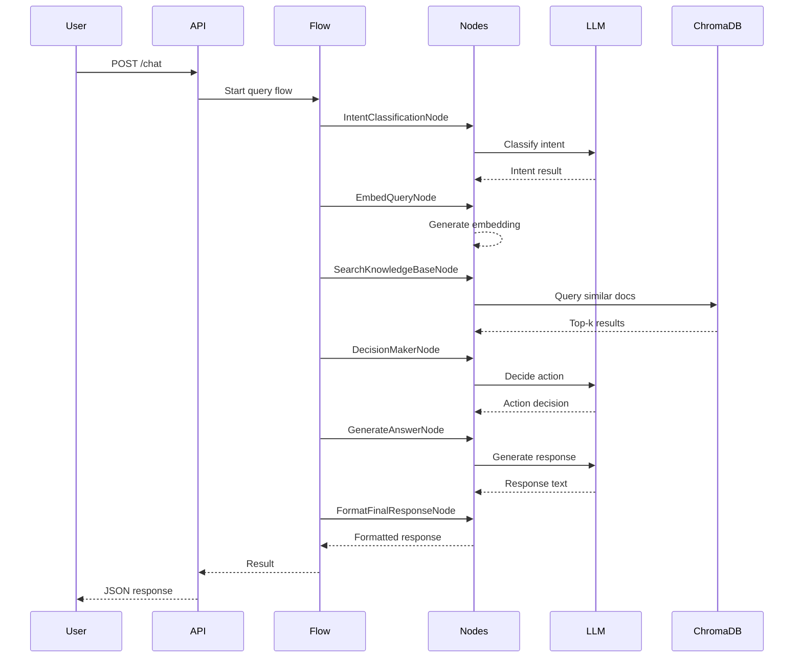
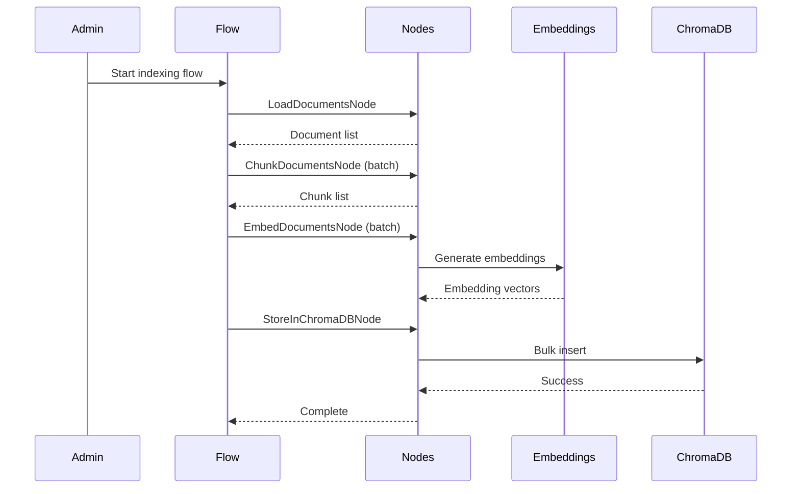

# Architecture Overview

This document provides a comprehensive overview of the Agentic IT Support Chatbot architecture.

## Table of Contents

- [High-Level Architecture](#high-level-architecture)
- [Core Components](#core-components)
- [Data Flow](#data-flow)
- [Node System](#node-system)
- [Flow Orchestration](#flow-orchestration)
- [Storage Architecture](#storage-architecture)
- [Design Patterns](#design-patterns)

## High-Level Architecture

The system follows a modular, agent-based architecture built on the **cremedelacreme** framework.

```
┌─────────────────────────────────────────────────────────┐
│                    User Interface                        │
│               (FastAPI / REST API)                       │
└─────────────────────┬───────────────────────────────────┘
                      │
┌─────────────────────▼───────────────────────────────────┐
│                  Flow Orchestrator                       │
│         (Query Flow / Indexing Flow)                     │
└─────┬───────────────┬───────────────┬───────────────────┘
      │               │               │
┌─────▼─────┐  ┌─────▼─────┐  ┌─────▼─────┐
│  Intent   │  │ Decision  │  │  Action   │
│  Nodes    │  │   Maker   │  │  Nodes    │
└─────┬─────┘  └─────┬─────┘  └─────┬─────┘
      │               │               │
      └───────────────┼───────────────┘
                      │
        ┌─────────────▼─────────────┐
        │     Shared Store          │
        │  (In-Memory Context)      │
        └─────────────┬─────────────┘
                      │
        ┌─────────────▼─────────────┐
        │    Utility Layer          │
        │  (LLM, Embeddings, etc.)  │
        └─────────────┬─────────────┘
                      │
        ┌─────────────▼─────────────┐
        │    Data Layer             │
        │  (ChromaDB, Memory)       │
        └───────────────────────────┘
```

## Core Components

### 1. API Layer (`main.py`)

**FastAPI application** that provides REST endpoints:

- `POST /chat` - Main chat endpoint
- `GET /health` - Health check
- `POST /index` - Trigger document indexing
- `GET /sessions/{session_id}` - Get session info

**Responsibilities:**
- Request validation
- Session management
- Response formatting
- Error handling

### 2. Flow Orchestration (`flows.py`)

**Three main flows:**

#### Query Flow
Handles user queries in real-time:
```
Intent → Embed → Search → Decide → Act → Format
```

#### Indexing Flow
Processes documents offline:
```
Load → Chunk → Embed → Store
```

#### Simple Query Flow
Streamlined version for testing:
```
Intent → Embed → Search → Answer → Format
```

### 3. Node System (`nodes.py`)

**Node Types:**

- **Regular Node**: Single execution per invocation
- **Batch Node**: Processes items in parallel batches
- **Agent Node**: Makes intelligent decisions

**Key Nodes:**

| Node | Type | Purpose |
|------|------|---------|
| IntentClassificationNode | Regular | Classify query intent |
| EmbedQueryNode | Regular | Generate query embeddings |
| SearchKnowledgeBaseNode | Regular | Retrieve relevant docs |
| DecisionMakerNode | Agent | Route to appropriate action |
| GenerateAnswerNode | Regular | Create response from context |
| AskClarifyingQuestionNode | Regular | Request more info |
| FormatFinalResponseNode | Regular | Format output |
| LoadDocumentsNode | Regular | Load files from directory |
| ChunkDocumentsNode | Batch | Split docs into chunks |
| EmbedDocumentsNode | Batch | Embed chunks in parallel |
| StoreInChromaDBNode | Regular | Persist to vector DB |

### 4. Utility Layer (`utils/`)

**Utilities:**

- `call_llm_groq.py` - LLM API wrapper
- `embedding_local.py` - Local embedding generation
- `intent_classifier.py` - Intent classification logic
- `conversation_memory.py` - Session management
- `chromadb_client.py` - Vector DB operations
- `chunker.py` - Document chunking
- `document_loader.py` - File loading
- `redactor.py` - Sensitive data redaction

### 5. Framework (`cremedelacreme/`)

Custom lightweight framework for agent orchestration:

- **Node**: Base class for execution units
- **BatchNode**: Parallel processing node
- **Flow**: DAG-based workflow orchestration
- Edge connections with conditional routing

## Data Flow

### Online Query Processing



### Offline Document Indexing



## Node System

### Node Lifecycle

Each node follows a **prep → exec → post** pattern:

```python
class MyNode(Node):
    def prep(self, shared: Dict) -> Any:
        """Read from shared store"""
        return shared["input_data"]
    
    def exec(self, prep_res: Any) -> Any:
        """Core logic (stateless)"""
        return process(prep_res)
    
    def post(self, shared: Dict, prep_res: Any, exec_res: Any) -> str:
        """Write to shared store, return edge"""
        shared["output"] = exec_res
        return "default"
```

### Batch Processing

BatchNodes process items in parallel:

```python
class MyBatchNode(BatchNode):
    def prep(self, shared: Dict) -> List[Any]:
        """Return list of items"""
        return shared["items"]
    
    def exec(self, item: Any) -> Any:
        """Process single item"""
        return process_one(item)
    
    def post(self, shared: Dict, prep_res: List, exec_res_list: List) -> str:
        """Aggregate results"""
        shared["results"] = exec_res_list
        return "default"
```

## Flow Orchestration

### Flow Creation

Flows are created by connecting nodes:

```python
# Create nodes
node_a = IntentNode()
node_b = SearchNode()
node_c = AnswerNode()

# Connect with default edge
_ = node_a >> node_b

# Connect with named edges
_ = node_b - "found" >> node_c
_ = node_b - "not_found" >> fallback_node

# Create flow
flow = Flow(start=node_a)
```

### Execution

```python
# Run flow with initial context
result = flow.run({
    "user_query": "How do I reset my password?",
    "session_id": "abc123"
})
```

## Storage Architecture

### Shared Store

In-memory dictionary for request context:

```python
shared = {
    "session_id": "uuid",
    "user_query": "...",
    "intent": {...},
    "query_embedding": [...],
    "retrieved_docs": [...],
    "rag_context": "...",
    "decision": {...},
    "response": {...}
}
```

### ChromaDB Schema

Vector database for document retrieval:

```python
{
    "ids": ["chunk_1", "chunk_2", ...],
    "embeddings": [[0.1, 0.2, ...], ...],
    "documents": ["VPN setup...", "Printer troubleshooting...", ...],
    "metadatas": [
        {
            "source_file": "vpn_guide.md",
            "chunk_index": 0,
            "doc_type": "guide",
            "category": "networking"
        },
        ...
    ]
}
```

### Conversation Memory

Persistent session storage:

```python
{
    "session_id": "uuid",
    "created_at": "timestamp",
    "last_activity": "timestamp",
    "conversation_history": [
        {"role": "user", "content": "...", "timestamp": "..."},
        {"role": "assistant", "content": "...", "timestamp": "..."}
    ],
    "workflow_state": {...}
}
```

## Design Patterns

### 1. Agent Pattern

**Decision Maker Node** routes to specialized agents:
- Search Agent (KB retrieval)
- Chat Agent (conversation)
- Ticket Agent (Jira operations)

### 2. RAG Pattern

**Retrieval-Augmented Generation:**
1. Embed user query
2. Retrieve similar documents
3. Augment prompt with context
4. Generate response

### 3. Workflow Pattern

**Interactive troubleshooting:**
1. Load workflow template
2. Execute steps sequentially
3. Get user feedback
4. Branch based on responses

### 4. Map-Reduce Pattern

**Batch processing:**
- Map: Process items in parallel
- Reduce: Aggregate results

### 5. Pipeline Pattern

**Sequential processing:**
- Each node transforms data
- Passes to next node
- Linear or branching paths

## Scalability Considerations

### Horizontal Scaling

- **API Layer**: Multiple FastAPI instances behind load balancer
- **ChromaDB**: Client-server mode with dedicated instance
- **Batch Nodes**: Parallel execution across workers

### Vertical Scaling

- Increase embedding batch size
- Larger context windows
- More powerful embedding models

### Caching

- Cache embeddings for common queries
- Cache LLM responses for factual queries
- Implement response memoization

## Security Architecture

### Privacy-First Design

- **Local Embeddings**: No external API calls for embedding
- **Data Redaction**: Remove sensitive info before logging
- **Session Isolation**: Per-user conversation contexts

### Authentication & Authorization

- API key authentication (optional)
- JWT tokens for session management
- Rate limiting per session

## Monitoring & Observability

### Logging

- Structured logging at each node
- Request/response logging
- Error tracking with stack traces

### Metrics

- Query latency per node
- Cache hit rates
- Document retrieval accuracy
- User satisfaction scores

## Future Architecture Enhancements

- [ ] Streaming responses
- [ ] Multi-modal support (images, PDFs)
- [ ] Distributed caching (Redis)
- [ ] Advanced reranking
- [ ] Multi-agent collaboration
- [ ] Plugin system for extensions

For implementation details, see the [design document](../docs/design.md).
